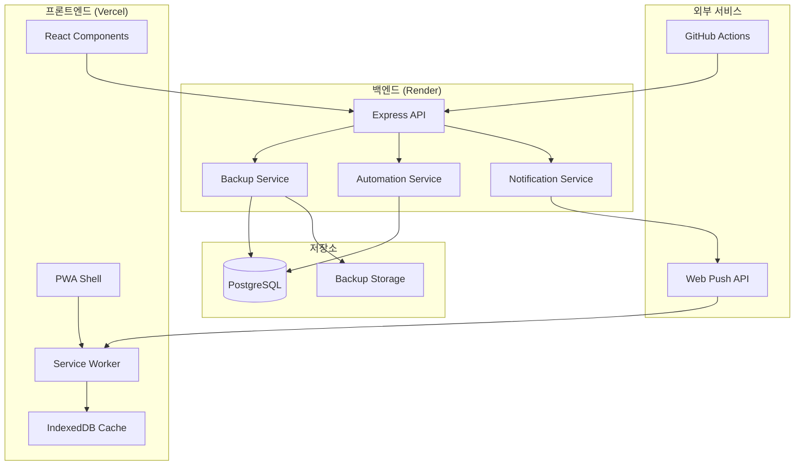

# CRM 핵심 기능 강화 - 설계 문서

## 개요

CHEMON CRM 시스템의 핵심 기능 3가지를 구현합니다:
1. **자동 백업 시스템** - 데이터 안전성 확보를 위한 수동/자동 백업 및 복구
2. **자동화 규칙 엔진** - 트리거 기반 워크플로우 자동화 (기존 구현 확장)
3. **모바일 PWA 지원** - 홈 화면 설치, 오프라인 지원, 푸시 알림

### 기술 스택
- **백엔드**: Node.js + Express + Prisma (Render 배포)
- **프론트엔드**: Next.js 14 + TypeScript (Vercel 배포)
- **데이터베이스**: PostgreSQL
- **PWA**: next-pwa + Workbox

### 제약사항
- Render 무료 티어: 백그라운드 작업 제한 → GitHub Actions 또는 외부 스케줄러 활용
- HTTPS 필수 (PWA, 푸시 알림)
- 한국어 UI

---

## 아키텍처



---

## 컴포넌트 및 인터페이스

### Feature 1: 자동 백업 시스템

#### 1.1 백엔드 컴포넌트

**BackupService 확장** (`backend/src/services/backupService.ts`)

```typescript
interface BackupData {
  metadata: {
    createdAt: string;
    version: string;
    tables: string[];
  };
  users?: User[];
  customers?: Customer[];
  leads?: Lead[];
  quotations?: Quotation[];
  contracts?: Contract[];
  studies?: Study[];
  systemSettings?: SystemSetting[];
  pipelineStages?: PipelineStage[];
  stageTasks?: StageTask[];
}

interface RestoreOptions {
  tables?: string[];  // 선택적 복구
  dryRun?: boolean;   // 미리보기 모드
}

interface RestoreResult {
  success: boolean;
  restoredTables: string[];
  recordCounts: Record<string, number>;
  errors?: string[];
}

// 확장 메서드
class BackupService {
  // 기존 메서드 유지
  async create(data?: CreateBackupDTO): Promise<BackupResponse>;
  async getAll(filters: BackupFilters): Promise<PaginatedBackupResult>;
  async getById(id: string): Promise<BackupResponse>;
  async delete(id: string): Promise<void>;
  
  // 신규 메서드
  async getBackupData(id: string): Promise<BackupData>;
  async restore(id: string, options?: RestoreOptions): Promise<RestoreResult>;
  async createScheduledBackup(): Promise<BackupResponse>;
  async cleanupOldBackups(retentionDays: number): Promise<number>;
}
```

**백업 대상 테이블** (요구사항 1.4)
- User (비밀번호 제외)
- Customer
- Lead
- Quotation
- Contract
- Study
- SystemSetting
- PipelineStage
- StageTask

**제외 테이블** (마스터 데이터)
- ToxicityTest
- EfficacyModel
- EfficacyPriceItem
- Modality
- PackageTemplate

#### 1.2 API 엔드포인트

```typescript
// 백업 관련 라우트 확장
POST   /api/admin/backups              // 수동 백업 생성
GET    /api/admin/backups              // 백업 목록 조회
GET    /api/admin/backups/:id          // 백업 상세 조회
GET    /api/admin/backups/:id/download // 백업 파일 다운로드
POST   /api/admin/backups/:id/restore  // 백업 복구
DELETE /api/admin/backups/:id          // 백업 삭제

// 스케줄러용 (인증 토큰 필요)
POST   /api/admin/backups/scheduled    // 자동 백업 실행
POST   /api/admin/backups/cleanup      // 오래된 백업 정리
```

#### 1.3 프론트엔드 컴포넌트

```typescript
// 백업 관리 페이지 컴포넌트
components/admin/
├── BackupManagement.tsx      // 백업 관리 메인 페이지
├── BackupList.tsx            // 백업 목록 테이블
├── BackupCreateDialog.tsx    // 수동 백업 생성 다이얼로그
├── BackupRestoreDialog.tsx   // 복구 확인 다이얼로그
└── BackupProgress.tsx        // 백업/복구 진행 상태
```

### Feature 2: 자동화 규칙 엔진 (기존 확장)

#### 2.1 기존 구현 현황

현재 `AutomationService`에 구현된 기능:
- 규칙 CRUD (생성, 조회, 수정, 삭제)
- 상태 변경 트리거 (`STATUS_CHANGE`)
- 항목 생성 트리거 (`ITEM_CREATED`)
- 항목 수정 트리거 (`ITEM_UPDATED`)
- 날짜 도달 트리거 (`DATE_REACHED`)
- 알림 발송 액션 (`SEND_NOTIFICATION`)
- 상태 업데이트 액션 (`UPDATE_STATUS`)
- 활동 생성 액션 (`CREATE_ACTIVITY`)

#### 2.2 확장 필요 사항

**날짜 기반 트리거 스케줄러**

```typescript
// 스케줄러 서비스 (GitHub Actions에서 호출)
interface SchedulerService {
  // 날짜 도달 트리거 처리
  processDateReachedTriggers(): Promise<{ processed: number; errors: number }>;
  
  // 견적 만료 체크
  processQuotationExpiry(): Promise<void>;
  
  // 리드 휴면 체크
  processLeadDormancy(inactiveDays: number): Promise<void>;
}
```

**프론트엔드 자동화 관리 UI**

```typescript
// 자동화 규칙 관리 컴포넌트
components/admin/
├── AutomationRuleList.tsx      // 규칙 목록
├── AutomationRuleForm.tsx      // 규칙 생성/수정 폼
├── AutomationTriggerConfig.tsx // 트리거 설정
├── AutomationActionConfig.tsx  // 액션 설정
├── AutomationConditionBuilder.tsx // 조건 빌더
└── AutomationExecutionLog.tsx  // 실행 로그
```

### Feature 3: 모바일 PWA 지원

#### 3.1 PWA 설정

**manifest.json**

```json
{
  "name": "CHEMON CRM",
  "short_name": "CHEMON",
  "description": "CHEMON 견적관리 시스템",
  "start_url": "/dashboard",
  "display": "standalone",
  "background_color": "#ffffff",
  "theme_color": "#3b82f6",
  "icons": [
    { "src": "/icons/icon-192.png", "sizes": "192x192", "type": "image/png" },
    { "src": "/icons/icon-512.png", "sizes": "512x512", "type": "image/png" }
  ]
}
```

**Service Worker 전략**

```typescript
// next.config.mjs with next-pwa
const withPWA = require('next-pwa')({
  dest: 'public',
  register: true,
  skipWaiting: true,
  runtimeCaching: [
    // 정적 자산 캐싱
    {
      urlPattern: /^https:\/\/.*\.(js|css|png|jpg|jpeg|svg|gif|woff|woff2)$/,
      handler: 'CacheFirst',
      options: {
        cacheName: 'static-assets',
        expiration: { maxEntries: 100, maxAgeSeconds: 7 * 24 * 60 * 60 }
      }
    },
    // API 응답 캐싱 (네트워크 우선)
    {
      urlPattern: /^https:\/\/.*\/api\/.*/,
      handler: 'NetworkFirst',
      options: {
        cacheName: 'api-cache',
        expiration: { maxEntries: 50, maxAgeSeconds: 60 * 60 }
      }
    }
  ]
});
```

#### 3.2 오프라인 지원

**IndexedDB 캐시 구조**

```typescript
interface OfflineCache {
  // 최근 조회 데이터 캐싱
  leads: Lead[];
  customers: Customer[];
  quotations: Quotation[];
  
  // 오프라인 작업 큐
  pendingActions: PendingAction[];
  
  // 메타데이터
  lastSyncAt: Date;
}

interface PendingAction {
  id: string;
  type: 'CREATE' | 'UPDATE' | 'DELETE';
  entity: string;
  data: Record<string, unknown>;
  createdAt: Date;
}
```

#### 3.3 푸시 알림

**Web Push 구현**

```typescript
// 백엔드: 푸시 구독 관리
interface PushSubscription {
  userId: string;
  endpoint: string;
  keys: {
    p256dh: string;
    auth: string;
  };
  createdAt: Date;
}

// 프론트엔드: 푸시 알림 요청
async function requestPushPermission(): Promise<boolean>;
async function subscribeToPush(): Promise<PushSubscription>;
async function unsubscribeFromPush(): Promise<void>;
```

#### 3.4 모바일 최적화 UI

**반응형 컴포넌트**

```typescript
// 모바일 전용 컴포넌트
components/mobile/
├── MobileNavigation.tsx      // 하단 네비게이션 바
├── MobileLeadCard.tsx        // 스와이프 가능한 리드 카드
├── MobileQuickActions.tsx    // 빠른 액션 버튼
├── PullToRefresh.tsx         // 풀투리프레시
└── OfflineIndicator.tsx      // 오프라인 상태 표시
```

---

## 데이터 모델

### 기존 모델 활용

```prisma
// 이미 정의된 모델 (schema.prisma)
model Backup {
  id        String   @id @default(uuid())
  filename  String
  size      BigInt
  status    String   @default("COMPLETED")  // PENDING, IN_PROGRESS, COMPLETED, FAILED
  type      String   @default("AUTO")       // AUTO, MANUAL
  createdAt DateTime @default(now())
}

model AutomationRule {
  id             String                @id @default(uuid())
  name           String
  description    String?
  triggerType    AutomationTriggerType
  triggerConfig  Json
  conditions     Json?
  status         AutomationStatus      @default(ACTIVE)
  priority       Int                   @default(0)
  executionCount Int                   @default(0)
  lastExecutedAt DateTime?
  lastError      String?
  createdBy      String
  isSystem       Boolean               @default(false)
  createdAt      DateTime              @default(now())
  updatedAt      DateTime              @updatedAt
  actions        AutomationAction[]
  executions     AutomationExecution[]
}
```

### 신규 모델

```prisma
// 푸시 구독 정보
model PushSubscription {
  id        String   @id @default(uuid())
  userId    String
  user      User     @relation(fields: [userId], references: [id], onDelete: Cascade)
  endpoint  String   @unique
  p256dh    String
  auth      String
  createdAt DateTime @default(now())
  updatedAt DateTime @updatedAt
  
  @@index([userId])
}

// 백업 데이터 저장 (선택적 - 파일 대신 DB 저장 시)
model BackupData {
  id        String   @id @default(uuid())
  backupId  String   @unique
  backup    Backup   @relation(fields: [backupId], references: [id], onDelete: Cascade)
  data      Json     // 백업 데이터 JSON
  createdAt DateTime @default(now())
}
```

---

## 정확성 속성 (Correctness Properties)

*정확성 속성은 시스템의 모든 유효한 실행에서 참이어야 하는 특성입니다. 이는 사람이 읽을 수 있는 명세와 기계가 검증할 수 있는 정확성 보장 사이의 다리 역할을 합니다.*


### Property 1: 백업 데이터 라운드트립

*For any* 유효한 백업 데이터에 대해, 백업 생성 후 해당 백업을 복구하면 원본 데이터와 동등한 데이터가 복원되어야 합니다.

**Validates: Requirements 1.2.3, 1.3.1, 1.3.3**

### Property 2: 백업 데이터 테이블 포함

*For any* 생성된 백업에 대해, 백업 데이터는 User, Customer, Lead, Quotation, Contract, Study, SystemSetting, PipelineStage, StageTask 테이블을 포함하고, ToxicityTest, EfficacyModel 등 마스터 데이터는 제외해야 합니다.

**Validates: Requirements 1.1.2, 1.4.1, 1.4.2, 1.4.3, 1.4.4**

### Property 3: 백업 보존 기간

*For any* 백업 정리 작업 실행 후, 7일 이상 된 백업은 삭제되고 7일 이내 백업은 유지되어야 합니다.

**Validates: Requirements 1.1.4**

### Property 4: 백업 목록 필드 포함

*For any* 백업 목록 조회 결과에 대해, 각 백업 항목은 id, filename, size, status, type, createdAt 필드를 포함해야 합니다.

**Validates: Requirements 1.2.4**

### Property 5: 선택적 복구

*For any* 특정 테이블만 선택하여 복구할 때, 선택된 테이블만 복구되고 선택되지 않은 테이블은 영향받지 않아야 합니다.

**Validates: Requirements 1.3.3, 1.3.4**

### Property 6: 자동화 규칙 CRUD 라운드트립

*For any* 유효한 자동화 규칙에 대해, 생성 후 조회하면 동일한 규칙 정보가 반환되어야 합니다.

**Validates: Requirements 2.1.1, 2.1.2, 2.1.4, 2.5.3**

### Property 7: 상태 변경 트리거 발동

*For any* 활성화된 상태 변경 트리거 규칙과 해당 모델(Lead, Quotation, Contract)의 상태 변경에 대해, 트리거 조건이 충족되면 규칙이 실행되어야 합니다.

**Validates: Requirements 2.2.1, 2.2.2, 2.2.3, 2.2.4**

### Property 8: 조건 평가

*For any* 자동화 규칙의 조건과 대상 엔티티에 대해, 조건 평가 결과는 엔티티의 실제 값과 조건 연산자에 따라 결정되어야 합니다.

**Validates: Requirements 2.1.3**

### Property 9: 날짜 기반 트리거 발동

*For any* 활성화된 날짜 도달 트리거 규칙에 대해, 지정된 날짜 필드가 현재 날짜 + N일과 일치하면 트리거가 발동해야 합니다.

**Validates: Requirements 2.3.1, 2.3.2, 2.3.3**

### Property 10: 액션 실행 결과

*For any* 자동화 규칙 실행에 대해, 알림 발송 액션은 알림을 생성하고, 상태 변경 액션은 상태를 변경하고, 활동 생성 액션은 활동을 생성해야 합니다.

**Validates: Requirements 2.4.1, 2.4.2, 2.4.3**

### Property 11: 실행 로그 기록

*For any* 자동화 규칙 실행에 대해, 실행 로그가 생성되고 ruleId, status, startedAt, completedAt 정보를 포함해야 합니다.

**Validates: Requirements 2.4.4, 2.5.4**

### Property 12: 규칙 토글

*For any* 자동화 규칙에 대해, 토글 실행 후 상태가 ACTIVE에서 INACTIVE로 또는 INACTIVE에서 ACTIVE로 변경되어야 합니다.

**Validates: Requirements 2.5.2**

### Property 13: 오프라인 캐시 라운드트립

*For any* 유효한 데이터에 대해, IndexedDB에 저장 후 조회하면 동일한 데이터가 반환되어야 합니다.

**Validates: Requirements 3.2.2**

### Property 14: 오프라인 동기화

*For any* 오프라인 상태에서 생성된 펜딩 액션에 대해, 온라인 복귀 시 서버와 동기화되고 펜딩 큐에서 제거되어야 합니다.

**Validates: Requirements 3.2.4**

### Property 15: 푸시 알림 발송

*For any* 푸시 구독이 있는 사용자와 알림 트리거 이벤트(리드 등록, 견적 상태 변경)에 대해, 해당 사용자에게 푸시 알림이 발송되어야 합니다.

**Validates: Requirements 3.4.2, 3.4.3**

---

## 에러 처리

### 백업 시스템

| 에러 상황 | 처리 방법 | HTTP 코드 |
|----------|----------|-----------|
| 백업 생성 실패 | 상태를 FAILED로 업데이트, 에러 로그 기록 | 500 |
| 백업 파일 없음 | 404 에러 반환 | 404 |
| 복구 중 데이터 무결성 오류 | 트랜잭션 롤백, 에러 상세 반환 | 400 |
| 권한 없음 | 관리자 권한 필요 메시지 | 403 |

### 자동화 엔진

| 에러 상황 | 처리 방법 | HTTP 코드 |
|----------|----------|-----------|
| 규칙 실행 실패 | 실행 로그에 에러 기록, 규칙 lastError 업데이트 | - |
| 잘못된 트리거 설정 | 유효성 검사 에러 반환 | 400 |
| 대상 엔티티 없음 | 실행 건너뛰기, 로그 기록 | - |
| 시스템 규칙 삭제 시도 | 삭제 불가 에러 반환 | 400 |

### PWA

| 에러 상황 | 처리 방법 |
|----------|----------|
| 오프라인 상태 | 캐시된 데이터 표시, 오프라인 배너 표시 |
| 동기화 실패 | 재시도 큐에 추가, 사용자에게 알림 |
| 푸시 권한 거부 | 인앱 알림으로 대체 |
| Service Worker 등록 실패 | 일반 웹앱으로 동작 |

---

## 테스팅 전략

### 단위 테스트

**백엔드**
- BackupService: 백업 생성, 복구, 정리 로직
- AutomationService: 규칙 CRUD, 조건 평가, 액션 실행
- PushService: 구독 관리, 알림 발송

**프론트엔드**
- 오프라인 캐시 유틸리티
- 동기화 로직
- PWA 설치 프롬프트 로직

### 속성 기반 테스트

속성 기반 테스트는 무작위로 생성된 입력에 대해 보편적 속성을 검증합니다. 각 테스트는 최소 100회 반복 실행됩니다.

**테스트 라이브러리**: fast-check

**구현할 속성 테스트**:

1. **백업 라운드트립 테스트** (Property 1)
   - 태그: `Feature: crm-core-enhancements, Property 1: 백업 데이터 라운드트립`

2. **백업 테이블 포함 테스트** (Property 2)
   - 태그: `Feature: crm-core-enhancements, Property 2: 백업 데이터 테이블 포함`

3. **자동화 규칙 CRUD 테스트** (Property 6)
   - 태그: `Feature: crm-core-enhancements, Property 6: 자동화 규칙 CRUD 라운드트립`

4. **조건 평가 테스트** (Property 8)
   - 태그: `Feature: crm-core-enhancements, Property 8: 조건 평가`

5. **오프라인 캐시 라운드트립 테스트** (Property 13)
   - 태그: `Feature: crm-core-enhancements, Property 13: 오프라인 캐시 라운드트립`

### 통합 테스트

- 백업 생성 → 복구 전체 플로우
- 자동화 규칙 생성 → 트리거 발동 → 액션 실행 플로우
- 오프라인 → 온라인 동기화 플로우

### E2E 테스트

- 관리자 백업 관리 페이지 플로우
- 자동화 규칙 관리 UI 플로우
- PWA 설치 및 오프라인 동작

---

## 구현 우선순위

### P0 (필수)
- 수동 백업 생성 및 다운로드
- 백업 데이터 범위 정의

### P1 (중요)
- 자동화 규칙 생성 UI
- 상태 변경 트리거
- PWA 기본 설정 (manifest, Service Worker)
- 모바일 최적화 UI (하단 네비게이션)

### P2 (선택)
- 일일 자동 백업 (GitHub Actions)
- 날짜 기반 트리거
- 오프라인 지원 (IndexedDB 캐싱)
- 푸시 알림
