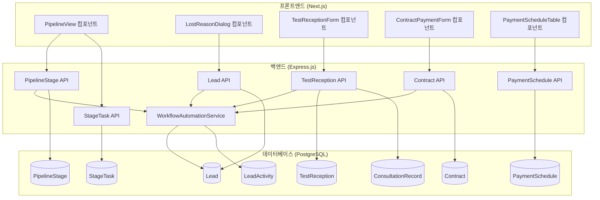
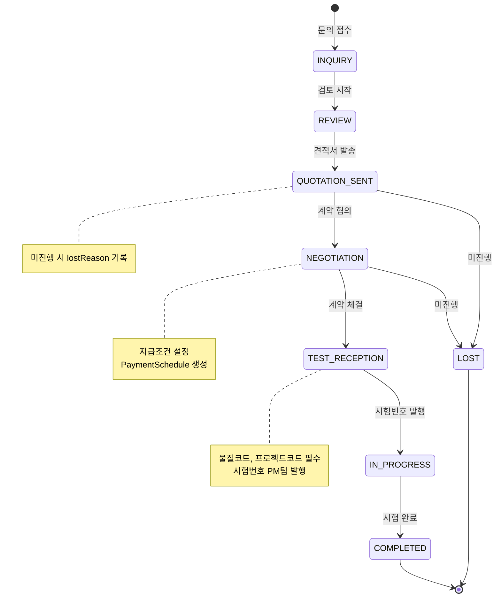

# 설계 문서: CRM Workflow Enhancement

## 개요

본 설계 문서는 CHEMON CRM 워크플로우를 실제 업무 프로세스(문의 → 계약)에 맞게 개선하는 기능의 기술적 설계를 정의합니다. 파이프라인 단계 재정의, 미진행 사유 관리, 시험 접수 정보 확장, 계약서 지급조건 유연화 기능을 구현합니다.

## 아키텍처



## 컴포넌트 및 인터페이스

### 1. 파이프라인 단계 관련 컴포넌트

#### 1.1 PipelineStageConfig (신규)

파이프라인 단계 설정 및 관리 컴포넌트입니다.

```typescript
// components/pipeline/PipelineStageConfig.tsx

interface PipelineStageConfigProps {
  stages: PipelineStage[];
  onStageUpdate: (stage: PipelineStage) => void;
  onTaskUpdate: (task: StageTask) => void;
}

interface PipelineStage {
  id: string;
  name: string;
  code: string;
  order: number;
  color: string;
  description?: string;
  isDefault: boolean;
  isActive: boolean;
  tasks: StageTask[];
}

interface StageTask {
  id: string;
  stageId: string;
  name: string;
  order: number;
  isRequired: boolean;
  description?: string;
  isActive: boolean;
}
```

#### 1.2 PipelineKanban (확장)

칸반 보드 형태의 파이프라인 뷰입니다.

```typescript
// components/pipeline/PipelineKanban.tsx

interface PipelineKanbanProps {
  leads: LeadWithTasks[];
  stages: PipelineStage[];
  onLeadMove: (leadId: string, newStageId: string) => void;
  onTaskComplete: (leadId: string, taskId: string) => void;
}

interface LeadWithTasks extends Lead {
  taskCompletions: LeadTaskCompletion[];
  completionRate: number; // 태스크 완료율
}
```

### 2. 미진행 사유 관련 컴포넌트

#### 2.1 LostReasonDialog (신규)

미진행 사유 입력 다이얼로그입니다.

```typescript
// components/lead/LostReasonDialog.tsx

interface LostReasonDialogProps {
  isOpen: boolean;
  onClose: () => void;
  onSubmit: (data: LostReasonData) => void;
  leadId: string;
}

interface LostReasonData {
  lostReason: LostReason;
  lostReasonDetail?: string;
}

type LostReason = 
  | 'BUDGET_PLANNING'    // 예산편성용
  | 'COMPETITOR_SELECTED' // 타사결정
  | 'PRICE_ISSUE'        // 가격문제
  | 'SCHEDULE_ISSUE'     // 일정문제
  | 'ON_HOLD'            // 대기중
  | 'OTHER';             // 기타

const lostReasonLabels: Record<LostReason, string> = {
  BUDGET_PLANNING: '예산편성용',
  COMPETITOR_SELECTED: '타사결정',
  PRICE_ISSUE: '가격문제',
  SCHEDULE_ISSUE: '일정문제',
  ON_HOLD: '대기중',
  OTHER: '기타',
};
```

#### 2.2 LostReasonStats (신규)

미진행 사유 통계 컴포넌트입니다.

```typescript
// components/analytics/LostReasonStats.tsx

interface LostReasonStatsProps {
  dateRange: { start: Date; end: Date };
}

interface LostReasonStatistics {
  totalLost: number;
  byReason: Record<LostReason, number>;
  byMonth: { month: string; count: number; reasons: Record<LostReason, number> }[];
}
```

### 3. 시험 접수 관련 컴포넌트

#### 3.1 TestReceptionForm (확장)

시험 접수 정보 입력 폼입니다.

```typescript
// components/test-reception/TestReceptionForm.tsx

interface TestReceptionFormProps {
  initialData?: TestReception;
  contractId?: string;
  onSubmit: (data: CreateTestReceptionDTO) => void;
  onCancel: () => void;
}

interface CreateTestReceptionDTO {
  customerId: string;
  requesterId?: string;
  contractId?: string;
  quotationId?: string;
  
  // 필수 필드
  substanceCode: string;      // 물질코드
  projectCode: string;        // 프로젝트코드
  substanceName?: string;     // 시험물질명
  institutionName?: string;   // 의뢰기관명
  
  // PM팀 발행 필드
  testNumber?: string;        // 시험번호 (PM팀 발행)
  testTitle?: string;         // 시험제목
  testDirector?: string;      // 시험책임자
  
  // 금액 정보
  totalAmount: number;
  
  // 일정
  receptionDate?: Date;
  expectedCompletionDate?: Date;
}
```

#### 3.2 ConsultationRecordForm (확장)

상담기록지 표준 양식입니다.

```typescript
// components/consultation/ConsultationRecordForm.tsx

interface ConsultationRecordFormProps {
  testReceptionId?: string;
  customerId: string;
  onSubmit: (data: CreateConsultationRecordDTO) => void;
}

interface CreateConsultationRecordDTO {
  customerId: string;
  contractId?: string;
  
  // 고객사 정보 (JSON)
  customerInfo: {
    companyName: string;
    contactName: string;
    contactPhone?: string;
    contactEmail?: string;
    department?: string;
    position?: string;
  };
  
  // 시험 정보 (JSON)
  testInfo?: {
    testType: string;
    testItems: string[];
    expectedDuration?: string;
    specialRequirements?: string;
  };
  
  // 물질 정보 (JSON)
  substanceInfo?: {
    substanceName: string;
    substanceType?: string;
    storageCondition?: string;
    hazardInfo?: string;
  };
  
  substanceName?: string;
  storageStatus?: string;
  storageLocation?: string;
  
  clientRequests?: string;
  internalNotes?: string;
  consultDate: Date;
}
```

### 4. 계약서 지급조건 관련 컴포넌트

#### 4.1 ContractPaymentForm (신규)

계약서 지급조건 설정 폼입니다.

```typescript
// components/contract/ContractPaymentForm.tsx

interface ContractPaymentFormProps {
  contract: Contract;
  onSubmit: (data: UpdateContractPaymentDTO) => void;
}

interface UpdateContractPaymentDTO {
  paymentType: PaymentType;
  
  // INSTALLMENT 타입용
  advancePaymentRate?: number;    // 선금 비율 (%)
  advancePaymentAmount?: number;  // 선금 금액
  balancePaymentAmount?: number;  // 잔금 금액
  
  // PER_TEST 타입용
  paymentSchedules?: CreatePaymentScheduleDTO[];
}

type PaymentType = 'FULL' | 'INSTALLMENT' | 'PER_TEST';

const paymentTypeLabels: Record<PaymentType, string> = {
  FULL: '일괄지급',
  INSTALLMENT: '분할지급 (선금/잔금)',
  PER_TEST: '시험번호별 지급',
};
```

#### 4.2 PaymentScheduleTable (신규)

시험번호별 지급 일정 테이블입니다.

```typescript
// components/contract/PaymentScheduleTable.tsx

interface PaymentScheduleTableProps {
  contractId: string;
  schedules: PaymentSchedule[];
  onStatusChange: (scheduleId: string, status: PaymentStatus) => void;
  onEdit: (schedule: PaymentSchedule) => void;
}

interface PaymentSchedule {
  id: string;
  contractId: string;
  testReceptionId?: string;
  testNumber?: string;
  amount: number;
  scheduledDate: Date;
  paidDate?: Date;
  status: PaymentStatus;
  notes?: string;
}

type PaymentStatus = 'PENDING' | 'SCHEDULED' | 'PAID' | 'OVERDUE';

interface CreatePaymentScheduleDTO {
  testReceptionId?: string;
  testNumber?: string;
  amount: number;
  scheduledDate: Date;
  notes?: string;
}
```

### 5. Backend Services

#### 5.1 PipelineInitializationService (신규)

파이프라인 초기화 서비스입니다.

```typescript
// backend/src/services/pipelineInitializationService.ts

interface PipelineInitializationService {
  initializeDefaultStages(): Promise<PipelineStage[]>;
  initializeStageTasksForStage(stageId: string, stageCode: string): Promise<StageTask[]>;
  getDefaultTasksForStage(stageCode: string): DefaultTask[];
}

interface DefaultTask {
  name: string;
  order: number;
  isRequired: boolean;
  description?: string;
}

const DEFAULT_STAGES: { code: string; name: string; color: string; order: number }[] = [
  { code: 'INQUIRY', name: '문의접수', color: '#6B7280', order: 1 },
  { code: 'REVIEW', name: '검토중', color: '#3B82F6', order: 2 },
  { code: 'QUOTATION_SENT', name: '견적발송', color: '#8B5CF6', order: 3 },
  { code: 'NEGOTIATION', name: '계약협의', color: '#F59E0B', order: 4 },
  { code: 'TEST_RECEPTION', name: '시험접수', color: '#10B981', order: 5 },
  { code: 'IN_PROGRESS', name: '시험진행', color: '#06B6D4', order: 6 },
  { code: 'COMPLETED', name: '완료', color: '#22C55E', order: 7 },
];
```

#### 5.2 WorkflowAutomationService (확장)

워크플로우 자동화 서비스입니다.

```typescript
// backend/src/services/workflowAutomationService.ts

interface WorkflowAutomationService {
  // 견적서 상태 변경 시
  onQuotationStatusChange(quotationId: string, newStatus: QuotationStatus): Promise<void>;
  
  // 계약서 상태 변경 시
  onContractStatusChange(contractId: string, newStatus: ContractStatus): Promise<void>;
  
  // 시험번호 발행 시
  onTestNumberIssued(testReceptionId: string): Promise<void>;
  
  // 시험 완료 시
  onStudyCompleted(studyId: string): Promise<void>;
  
  // 리드 단계 변경
  updateLeadStage(leadId: string, stageCode: string): Promise<Lead>;
  
  // 단계별 태스크 생성
  createTasksForStage(leadId: string, stageId: string): Promise<LeadTaskCompletion[]>;
  
  // 활동 기록 생성
  createStageChangeActivity(leadId: string, userId: string, fromStage: string, toStage: string): Promise<LeadActivity>;
}
```

#### 5.3 PaymentScheduleService (신규)

지급 일정 관리 서비스입니다.

```typescript
// backend/src/services/paymentScheduleService.ts

interface PaymentScheduleService {
  createSchedules(contractId: string, schedules: CreatePaymentScheduleDTO[]): Promise<PaymentSchedule[]>;
  updateScheduleStatus(scheduleId: string, status: PaymentStatus, paidDate?: Date): Promise<PaymentSchedule>;
  getContractPaymentSummary(contractId: string): Promise<PaymentSummary>;
  checkAndUpdateContractStatus(contractId: string): Promise<Contract>;
}

interface PaymentSummary {
  totalAmount: number;
  paidAmount: number;
  remainingAmount: number;
  schedules: PaymentSchedule[];
  completionRate: number;
}
```

### 6. API 엔드포인트

#### 6.1 PipelineStage API

```typescript
// GET /api/pipeline-stages
// 모든 파이프라인 단계 조회 (태스크 포함)
interface GetPipelineStagesResponse {
  stages: (PipelineStage & { tasks: StageTask[] })[];
}

// POST /api/pipeline-stages/initialize
// 기본 파이프라인 단계 초기화
interface InitializePipelineResponse {
  stages: PipelineStage[];
  tasksCreated: number;
}
```

#### 6.2 Lead API 확장

```typescript
// PUT /api/leads/:id/lost
// 미진행 사유 기록
interface UpdateLeadLostDTO {
  lostReason: LostReason;
  lostReasonDetail?: string;
}

// GET /api/leads/lost-reason-stats
// 미진행 사유 통계
interface LostReasonStatsQuery {
  startDate?: string;
  endDate?: string;
  userId?: string;
}

interface LostReasonStatsResponse {
  totalLost: number;
  byReason: Record<LostReason, number>;
  byMonth: { month: string; count: number; reasons: Record<LostReason, number> }[];
}
```

#### 6.3 TestReception API 확장

```typescript
// POST /api/test-receptions
// 시험 접수 생성 (물질코드, 프로젝트코드 필수)
interface CreateTestReceptionDTO {
  customerId: string;
  substanceCode: string;  // 필수
  projectCode: string;    // 필수
  // ... 기타 필드
}

// PUT /api/test-receptions/:id/issue-test-number
// 시험번호 발행
interface IssueTestNumberDTO {
  testNumber: string;
  testTitle?: string;
  testDirector?: string;
}

// GET /api/test-receptions/:id/with-consultation
// 시험 접수 + 상담기록 조회
interface TestReceptionWithConsultation extends TestReception {
  consultationRecords: ConsultationRecord[];
}
```

#### 6.4 Contract API 확장

```typescript
// PUT /api/contracts/:id/payment-settings
// 지급조건 설정
interface UpdateContractPaymentDTO {
  paymentType: PaymentType;
  advancePaymentRate?: number;
  advancePaymentAmount?: number;
  balancePaymentAmount?: number;
}

// GET /api/contracts/:id/payment-summary
// 지급 현황 조회
interface ContractPaymentSummaryResponse {
  contract: Contract;
  paymentSummary: PaymentSummary;
}
```

#### 6.5 PaymentSchedule API (신규)

```typescript
// POST /api/payment-schedules
// 지급 일정 생성
interface CreatePaymentScheduleDTO {
  contractId: string;
  testReceptionId?: string;
  testNumber?: string;
  amount: number;
  scheduledDate: string;
  notes?: string;
}

// PUT /api/payment-schedules/:id/status
// 지급 상태 변경
interface UpdatePaymentStatusDTO {
  status: PaymentStatus;
  paidDate?: string;
}

// GET /api/payment-schedules/by-contract/:contractId
// 계약별 지급 일정 조회
interface GetPaymentSchedulesResponse {
  schedules: PaymentSchedule[];
  summary: PaymentSummary;
}
```

## 데이터 모델

### 1. Lead 모델 확장

```prisma
model Lead {
  // ... 기존 필드
  
  // 미진행 사유 (확장)
  lostReason       String?   // LostReason enum 값
  lostReasonDetail String?   // 기타 사유 상세
  lostAt           DateTime? // 미진행 처리 일시
}
```

### 2. Contract 모델 확장

```prisma
model Contract {
  // ... 기존 필드
  
  // 지급조건 (신규)
  paymentType           String    @default("FULL") // FULL, INSTALLMENT, PER_TEST
  advancePaymentRate    Decimal?  @db.Decimal(5, 2) // 선금 비율 (%)
  advancePaymentAmount  Decimal?  @db.Decimal(15, 2) // 선금 금액
  balancePaymentAmount  Decimal?  @db.Decimal(15, 2) // 잔금 금액
  
  // 관계
  paymentSchedules PaymentSchedule[]
}
```

### 3. PaymentSchedule 모델 (신규)

```prisma
model PaymentSchedule {
  id              String    @id @default(uuid())
  contractId      String
  contract        Contract  @relation(fields: [contractId], references: [id], onDelete: Cascade)
  testReceptionId String?
  testNumber      String?   // 시험번호
  
  amount          Decimal   @db.Decimal(15, 2)
  scheduledDate   DateTime  // 예정일
  paidDate        DateTime? // 지급일
  status          String    @default("PENDING") // PENDING, SCHEDULED, PAID, OVERDUE
  notes           String?
  
  createdAt       DateTime  @default(now())
  updatedAt       DateTime  @updatedAt
  
  @@index([contractId])
  @@index([status])
}
```

### 4. TestReception 모델 확장

```prisma
model TestReception {
  // ... 기존 필드 (이미 substanceCode, projectCode, testNumber 존재)
  
  // 상담기록 연결 (신규)
  consultationRecordId String?
  
  // 시험번호 발행 정보 (신규)
  testNumberIssuedAt   DateTime?
  testNumberIssuedBy   String?
}
```

### 5. 데이터 흐름




## 정확성 속성 (Correctness Properties)

*정확성 속성은 시스템의 모든 유효한 실행에서 참이어야 하는 특성 또는 동작입니다. 이는 사람이 읽을 수 있는 명세와 기계가 검증할 수 있는 정확성 보장 사이의 다리 역할을 합니다.*

### Property 1: 파이프라인 초기화 무결성

*For any* 파이프라인 초기화 실행에서, 생성된 PipelineStage 레코드의 수는 정확히 7개여야 하고, 각 단계의 order 필드는 1부터 7까지 연속적이어야 하며, 각 단계에는 최소 1개 이상의 StageTask가 연결되어야 합니다.

**Validates: Requirements 1.2, 1.3**

### Property 2: 미진행 사유 유효성 검사

*For any* 리드 상태가 LOST로 변경되는 요청에서, lostReason 필드가 null이거나 빈 문자열이면 요청이 거부되어야 합니다. 또한, lostReason이 'OTHER'인 경우 lostReasonDetail 필드가 null이거나 빈 문자열이면 요청이 거부되어야 합니다.

**Validates: Requirements 2.3, 2.4**

### Property 3: 활동 로그 생성 일관성

*For any* 리드의 상태 변경(status 또는 stageId 변경)이 발생할 때, LeadActivity 테이블에 해당 변경을 기록하는 새 레코드가 생성되어야 하고, 해당 레코드의 leadId는 변경된 리드의 id와 일치해야 합니다.

**Validates: Requirements 2.6, 5.6**

### Property 4: 시험 접수 필수 필드 검증

*For any* 시험 접수(TestReception) 생성 요청에서, substanceCode 또는 projectCode 필드가 null이거나 빈 문자열이면 요청이 거부되어야 합니다.

**Validates: Requirements 3.2**

### Property 5: 시험번호 발행 데이터 무결성

*For any* 시험번호 발행 요청이 성공하면, 해당 TestReception의 testNumber 필드가 업데이트되고, testNumberIssuedAt 필드에 현재 시간이 기록되어야 합니다. 또한, 연결된 Lead가 존재하면 해당 Lead의 stageId가 'TEST_RECEPTION' 또는 'IN_PROGRESS' 단계로 업데이트되어야 합니다.

**Validates: Requirements 3.3, 3.7**

### Property 6: 시험 접수-상담기록 연동

*For any* 시험 접수 조회 요청에서 withConsultation 옵션이 true인 경우, 응답에는 해당 시험 접수와 연결된 모든 ConsultationRecord가 포함되어야 합니다.

**Validates: Requirements 3.5**

### Property 7: 계약 금액 자동 계산

*For any* 계약(Contract) 생성 시 연결된 견적서(Quotation)가 존재하면, 계약의 totalAmount는 연결된 견적서들의 totalAmount 합계와 일치해야 합니다.

**Validates: Requirements 4.5**

### Property 8: 지급 일정 합계 일관성

*For any* 계약에 연결된 PaymentSchedule의 status가 PAID로 변경되면, 해당 계약의 paidAmount는 모든 PAID 상태인 PaymentSchedule의 amount 합계와 일치해야 합니다.

**Validates: Requirements 4.6**

### Property 9: 계약 완료 자동 전환

*For any* 계약에 연결된 모든 PaymentSchedule의 status가 PAID인 경우, 해당 계약의 status는 COMPLETED여야 합니다.

**Validates: Requirements 4.8**

### Property 10: PER_TEST 지급 유형 일관성

*For any* paymentType이 'PER_TEST'인 계약에서, 해당 계약에는 최소 1개 이상의 PaymentSchedule이 연결되어야 하고, 모든 PaymentSchedule의 amount 합계는 계약의 totalAmount와 일치해야 합니다.

**Validates: Requirements 4.3**

### Property 11: 워크플로우 자동화 일관성

*For any* 견적서 상태가 SENT로 변경되고 연결된 리드가 존재하면, 해당 리드의 stageId는 'QUOTATION_SENT' 단계로 업데이트되어야 합니다. 계약서 상태가 SIGNED로 변경되고 연결된 리드가 존재하면, 해당 리드의 stageId는 'TEST_RECEPTION' 단계로 업데이트되어야 합니다. Study 상태가 COMPLETED로 변경되고 연결된 리드가 존재하면, 해당 리드의 stageId는 'COMPLETED' 단계로 업데이트되어야 합니다.

**Validates: Requirements 5.2, 5.3, 5.5**

### Property 12: 단계 변경 시 태스크 자동 생성

*For any* 리드의 stageId가 변경되면, 새 단계에 정의된 StageTask에 대응하는 LeadTaskCompletion 레코드가 해당 리드에 대해 생성되어야 합니다.

**Validates: Requirements 5.1**

## 오류 처리

### 1. 파이프라인 초기화 오류

| 오류 상황 | 처리 방법 |
|----------|----------|
| 이미 초기화된 상태에서 재초기화 시도 | "파이프라인이 이미 초기화되어 있습니다" 메시지 반환, 기존 데이터 유지 |
| 단계 생성 중 DB 오류 | 트랜잭션 롤백, 오류 로그 기록 |
| 태스크 생성 실패 | 단계는 유지하고 태스크 생성 재시도, 실패 시 로그 기록 |

### 2. 미진행 사유 기록 오류

| 오류 상황 | 처리 방법 |
|----------|----------|
| lostReason 누락 | 400 Bad Request, "미진행 사유를 선택해주세요" 메시지 |
| OTHER 선택 시 상세 사유 누락 | 400 Bad Request, "기타 사유를 입력해주세요" 메시지 |
| 이미 LOST 상태인 리드 재처리 | 기존 사유 유지, 업데이트 허용 |

### 3. 시험 접수 오류

| 오류 상황 | 처리 방법 |
|----------|----------|
| 필수 필드(substanceCode, projectCode) 누락 | 400 Bad Request, 누락된 필드 명시 |
| 중복 시험번호 발행 시도 | 409 Conflict, "이미 사용 중인 시험번호입니다" 메시지 |
| 존재하지 않는 고객/계약 연결 시도 | 404 Not Found, 해당 리소스 명시 |

### 4. 지급 일정 오류

| 오류 상황 | 처리 방법 |
|----------|----------|
| 지급 금액 합계 불일치 | 400 Bad Request, "지급 금액 합계가 계약 금액과 일치하지 않습니다" |
| 이미 PAID 상태인 일정 재처리 | 기존 상태 유지, 경고 메시지 반환 |
| 계약 금액 초과 지급 시도 | 400 Bad Request, "지급 금액이 계약 금액을 초과합니다" |

### 5. 워크플로우 자동화 오류

| 오류 상황 | 처리 방법 |
|----------|----------|
| 연결된 리드 없음 | 자동화 스킵, 정상 완료 처리 |
| 단계 조회 실패 | 기본 단계로 폴백, 오류 로그 기록 |
| 활동 기록 생성 실패 | 주요 작업은 완료, 로그 생성 실패만 기록 |

## 테스트 전략

### 1. 단위 테스트

단위 테스트는 특정 예제, 엣지 케이스, 오류 조건을 검증합니다.

#### 프론트엔드 컴포넌트 테스트
- PipelineStageConfig 컴포넌트 렌더링 테스트
- LostReasonDialog 유효성 검사 테스트
- TestReceptionForm 필수 필드 검증 테스트
- ContractPaymentForm 지급 유형별 렌더링 테스트
- PaymentScheduleTable 상태 변경 이벤트 테스트

#### 백엔드 서비스 테스트
- PipelineInitializationService.initializeDefaultStages 성공/실패 케이스
- WorkflowAutomationService 각 이벤트별 동작 테스트
- PaymentScheduleService.updateScheduleStatus 상태 전이 테스트
- 미진행 사유 통계 API 응답 형식 테스트

### 2. 속성 기반 테스트 (Property-Based Testing)

속성 기반 테스트는 모든 유효한 입력에 대해 보편적 속성을 검증합니다. 각 테스트는 최소 100회 반복 실행됩니다.

#### 테스트 라이브러리
- Backend: fast-check (TypeScript/JavaScript)
- Frontend: @fast-check/vitest

#### 속성 테스트 목록

```typescript
// Feature: crm-workflow-enhancement, Property 1: 파이프라인 초기화 무결성
describe('Pipeline Initialization Integrity', () => {
  it('should create exactly 7 stages with consecutive order values and tasks', async () => {
    // 테스트 구현
  });
});

// Feature: crm-workflow-enhancement, Property 2: 미진행 사유 유효성 검사
describe('Lost Reason Validation', () => {
  it.prop([fc.constantFrom('BUDGET_PLANNING', 'COMPETITOR_SELECTED', 'PRICE_ISSUE', 'SCHEDULE_ISSUE', 'ON_HOLD', 'OTHER'), fc.option(fc.string())])(
    'should require lostReasonDetail when lostReason is OTHER',
    async (lostReason, lostReasonDetail) => {
      // 테스트 구현
    }
  );
});

// Feature: crm-workflow-enhancement, Property 4: 시험 접수 필수 필드 검증
describe('Test Reception Required Fields', () => {
  it.prop([fc.option(fc.string()), fc.option(fc.string())])(
    'should reject creation when substanceCode or projectCode is missing',
    async (substanceCode, projectCode) => {
      // 테스트 구현
    }
  );
});

// Feature: crm-workflow-enhancement, Property 8: 지급 일정 합계 일관성
describe('Payment Schedule Sum Consistency', () => {
  it.prop([contractArbitrary, fc.array(paymentScheduleArbitrary)])(
    'should update contract paidAmount to match sum of PAID schedules',
    async (contract, schedules) => {
      // 테스트 구현
    }
  );
});

// Feature: crm-workflow-enhancement, Property 10: PER_TEST 지급 유형 일관성
describe('PER_TEST Payment Type Consistency', () => {
  it.prop([contractWithPerTestArbitrary])(
    'should have payment schedules summing to totalAmount',
    async (contract) => {
      // 테스트 구현
    }
  );
});

// Feature: crm-workflow-enhancement, Property 11: 워크플로우 자동화 일관성
describe('Workflow Automation Consistency', () => {
  it.prop([quotationArbitrary, leadArbitrary])(
    'should update lead stage when quotation status changes to SENT',
    async (quotation, lead) => {
      // 테스트 구현
    }
  );
});
```

### 3. 통합 테스트

- 파이프라인 초기화 → 단계별 태스크 생성 전체 플로우
- 견적서 발송 → 리드 단계 변경 → 활동 기록 생성 전체 플로우
- 계약 체결 → 지급 일정 생성 → 지급 완료 → 계약 완료 전체 플로우
- 시험 접수 → 시험번호 발행 → 리드 단계 변경 전체 플로우

### 4. E2E 테스트

- 파이프라인 칸반 보드에서 리드 드래그 앤 드롭 테스트
- 미진행 사유 다이얼로그 입력 및 저장 테스트
- 시험 접수 폼 작성 및 시험번호 발행 테스트
- 계약서 지급조건 설정 및 지급 일정 관리 테스트
