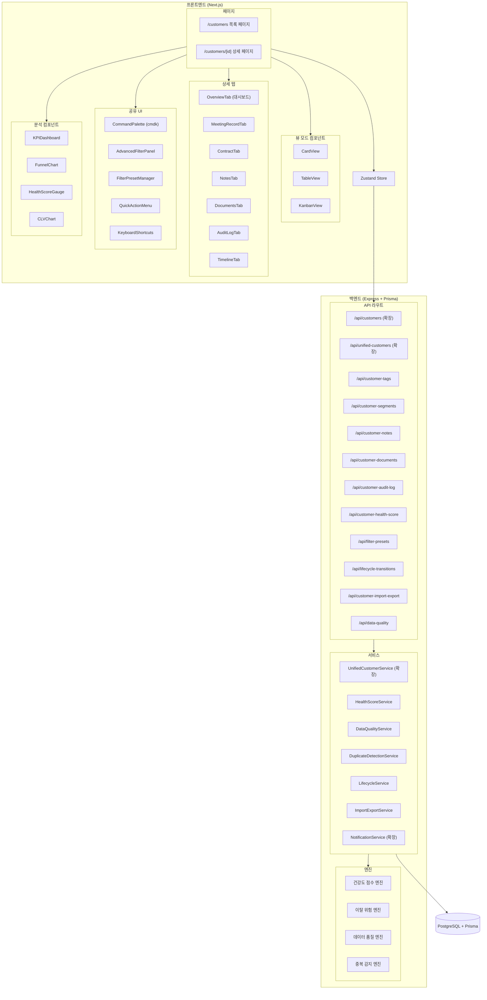

# 설계 문서: 전문 CRM 수준 고객사 관리 모듈

## 개요

본 설계 문서는 기존 고객사 관리 모듈(`/customers`)을 전문 CRM 수준으로 대폭 개선하기 위한 기술 설계를 정의합니다.

현재 시스템은 Next.js 프론트엔드(chemon-quotation/)와 Express+Prisma 백엔드(backend/)로 구성되어 있으며, 카드 기반 통합 목록(UnifiedCustomerCard), 탭 기반 상세 페이지, 기본 필터링/검색 기능을 갖추고 있습니다. 이 설계는 기존 아키텍처를 확장하여 다음 핵심 기능을 추가합니다:

- **뷰 모드 전환**: 카드/테이블/칸반 뷰 + 드래그 앤 드롭 단계 변경
- **고급 필터링 및 프리셋**: 다중 조건 필터, 저장된 필터 프리셋
- **고객 건강도 및 이탈 위험 분석**: 가중치 기반 점수 엔진
- **세그먼트/태그 시스템**: 고객 분류 및 일괄 작업
- **데이터 품질 관리 및 중복 감지**: 편집 거리 기반 중복 탐지
- **감사 추적 및 커스텀 필드**: 변경 이력 추적, 사용자 정의 필드
- **워크플로우 자동화 및 알림**: 이벤트 기반 자동 알림
- **고급 분석 대시보드**: 전환 퍼널, CLV, 이탈률 차트
- **대량 가져오기/내보내기**: Excel/CSV 매핑 및 유효성 검사
- **메모/문서 관리 및 팀 협업**: @멘션, 파일 첨부
- **반응형 모바일 UX**: 모바일 최적화 레이아웃
- **성능 최적화**: 무한 스크롤, 탭 캐싱, 낙관적 업데이트
- **라이프사이클 관리**: 단계 전환 추적 및 퍼널 분석

### 기술 스택 선택

| 영역 | 기술 | 선택 이유 |
|------|------|-----------|
| 차트 | recharts | React 네이티브, 선언적 API, 반응형 지원 |
| 드래그 앤 드롭 | @dnd-kit | 접근성 우수, React 18 호환, 가벼움 |
| 커맨드 팔레트 | cmdk | shadcn/ui 호환, 경량, 키보드 네비게이션 |
| 리치 텍스트 | tiptap | 확장 가능, @멘션 플러그인 내장 |
| Excel 처리 | xlsx (SheetJS) | 브라우저/서버 양쪽 지원, .xlsx/.csv 호환 |
| 가상 스크롤 | @tanstack/react-virtual | 대량 데이터 렌더링 최적화 |
| 테이블 | @tanstack/react-table | 정렬, 필터, 열 관리 내장 |

## 아키텍처

### 전체 시스템 아키텍처



### 설계 원칙

1. **기존 아키텍처 확장**: 현재 `UnifiedCustomerService`, `CustomerCrmService` 패턴을 유지하며 확장
2. **점진적 마이그레이션**: 기존 `UnifiedEntity` 타입을 확장하여 하위 호환성 유지
3. **서버 사이드 계산**: 건강도 점수, 이탈 위험, 데이터 품질 점수는 백엔드에서 산출
4. **낙관적 업데이트**: 칸반 드래그 앤 드롭 등 즉각적 UI 반응이 필요한 곳에 적용
5. **캐싱 전략**: 탭 데이터 캐싱, 필터 프리셋 로컬 캐싱으로 불필요한 API 호출 최소화


## 컴포넌트 및 인터페이스

### 프론트엔드 컴포넌트 구조

#### 1. 목록 페이지 컴포넌트 (`/customers`)

```
customers/page.tsx (확장)
├── ViewModeToggle                    # 카드/테이블/칸반 전환 토글
├── AdvancedFilterPanel (확장)        # 고급 필터 패널
│   ├── FilterChips                   # 적용된 필터 칩 표시
│   ├── FilterPresetDropdown          # 저장된 프리셋 드롭다운
│   └── SaveFilterDialog              # 필터 저장 다이얼로그
├── SortControl                       # 정렬 컨트롤
├── KPIDashboard (확장)               # 통계 대시보드
│   ├── StatCard                      # KPI 카드 (신규/활성/미수금)
│   ├── GradeDistributionChart        # 등급별 도넛 차트
│   ├── ConversionFunnelChart         # 전환 퍼널 차트
│   ├── ChurnRateChart                # 이탈률 추이 차트
│   └── SegmentCLVChart               # 세그먼트별 CLV 차트
├── CardView                          # 카드 뷰 (기존 확장)
│   └── EnhancedCustomerCard          # 개선된 고객 카드
│       ├── HealthScoreGauge          # 건강도 게이지
│       ├── TagChips                  # 태그 칩 (최대 3개)
│       ├── QuickActionOverlay        # 호버 시 빠른 액션
│       └── ChurnWarningBadge         # 이탈 위험 경고
├── TableView                         # 테이블 뷰 (신규)
│   └── CustomerTable                 # @tanstack/react-table 기반
├── KanbanView                        # 칸반 뷰 (신규)
│   ├── KanbanColumn                  # 단계별 열
│   └── KanbanCard                    # 드래그 가능한 카드
├── BulkActionBar                     # 일괄 작업 바
├── ImportExportPanel                 # 가져오기/내보내기
│   ├── ImportWizard                  # 가져오기 마법사
│   │   ├── FileUploadStep            # 파일 업로드
│   │   ├── ColumnMappingStep         # 열 매핑
│   │   ├── ValidationStep            # 유효성 검사
│   │   └── ResultSummary             # 결과 요약
│   └── ExportDialog                  # 내보내기 다이얼로그
├── CommandPalette                    # 커맨드 팔레트 (cmdk)
└── KeyboardShortcutOverlay           # 단축키 도움말
```

#### 2. 상세 페이지 컴포넌트 (`/customers/[id]`)

```
customers/[id]/page.tsx (확장)
├── CustomerSummaryHeader (확장)      # 360도 뷰 헤더
│   ├── HealthScoreGauge              # 건강도 게이지
│   ├── ChurnRiskGauge                # 이탈 위험 게이지
│   ├── DataQualityBar                # 데이터 품질 바
│   ├── KPICards                      # CLV, 미수금, 활성계약 등
│   ├── QuickActionButtons            # 빠른 액션 버튼
│   ├── TagEditor                     # 태그 편집
│   └── SegmentSelector               # 세그먼트 선택
├── OverviewTab (확장/대시보드화)
│   ├── MiniCharts                    # 월별 견적/계약 추이
│   ├── LifecycleTimeline             # 라이프사이클 전환 이력
│   ├── RecentActivityTimeline        # 최근 활동 (5건)
│   ├── UpcomingSchedule              # 다가오는 일정
│   ├── OutstandingPaymentBanner      # 미수금 경고
│   ├── CLVComparison                 # CLV 비교
│   ├── ProgressChecklist             # 진행 체크리스트
│   └── PinnedNotes                   # 고정 메모
├── MeetingRecordTab (확장)
│   └── InlineMeetingForm             # 인라인 미팅 추가
├── ContractTab (기존)
├── RequesterTab (확장)
│   └── InlineRequesterForm           # 인라인 의뢰자 추가
├── ConsultationTab (확장)
│   └── InlineConsultationForm        # 인라인 상담 추가
├── NotesTab (신규)
│   ├── NoteEditor (tiptap)           # 리치 텍스트 + @멘션
│   ├── NoteList                      # 메모 목록
│   └── PinToggle                     # 고정 토글
├── DocumentsTab (신규)
│   ├── FileUploader                  # 파일 업로드
│   └── DocumentList                  # 문서 목록
├── AuditLogTab (신규)
│   ├── AuditLogList                  # 변경 이력 목록
│   └── AuditLogFilter                # 필터 (필드, 변경자, 기간)
├── ActivityTimelineTab (확장)
│   └── UnifiedTimeline               # 통합 타임라인
└── CustomFieldsSection               # 커스텀 필드 영역
```

### 백엔드 서비스 구조

#### 신규 서비스

| 서비스 | 파일 경로 | 역할 |
|--------|-----------|------|
| `HealthScoreService` | `backend/src/services/healthScoreService.ts` | 건강도 점수 산출 (가중치 기반) |
| `ChurnRiskService` | `backend/src/services/churnRiskService.ts` | 이탈 위험 점수 산출 |
| `DataQualityService` | `backend/src/services/dataQualityService.ts` | 데이터 품질 점수 산출, 중복 감지 |
| `LifecycleService` | `backend/src/services/lifecycleService.ts` | 라이프사이클 전환 관리 |
| `CustomerTagService` | `backend/src/services/customerTagService.ts` | 태그 CRUD, 일괄 작업 |
| `CustomerNoteService` | `backend/src/services/customerNoteService.ts` | 메모 CRUD, @멘션 알림 |
| `CustomerDocumentService` | `backend/src/services/customerDocumentService.ts` | 문서 업로드/관리 |
| `AuditLogService` | `backend/src/services/auditLogService.ts` | 감사 추적 기록/조회 |
| `FilterPresetService` | `backend/src/services/filterPresetService.ts` | 필터 프리셋 CRUD |
| `ImportExportService` | `backend/src/services/importExportService.ts` | Excel/CSV 가져오기/내보내기 |
| `CustomerAnalyticsService` | `backend/src/services/customerAnalyticsService.ts` | KPI, 전환 퍼널, CLV 분석 |

#### 확장 서비스

| 서비스 | 확장 내용 |
|--------|-----------|
| `UnifiedCustomerService` | 건강도/이탈위험/데이터품질 점수 포함, 고급 필터/정렬 지원, 칸반 뷰 데이터 |
| `CustomerCrmService` | 통합 타임라인에 메모/문서/이메일 포함 |
| `NotificationService` | 워크플로우 자동화 알림 (비활동, 계약만료, 기념일, 미수금 에스컬레이션) |


### API 엔드포인트 설계

#### 통합 고객 API (확장)

```
GET    /api/unified-customers                    # 통합 목록 (확장된 필터/정렬)
GET    /api/unified-customers/kanban             # 칸반 뷰 데이터 (단계별 그룹핑)
PATCH  /api/unified-customers/:id/stage          # 단계 변경 (칸반 드래그 앤 드롭)
GET    /api/unified-customers/analytics          # KPI 대시보드 데이터
GET    /api/unified-customers/funnel             # 전환 퍼널 데이터
GET    /api/unified-customers/churn-rate         # 이탈률 추이
```

#### 건강도/이탈 위험 API

```
GET    /api/customers/:id/health-score           # 건강도 점수 조회
GET    /api/customers/:id/health-score/history    # 건강도 추이 (90일)
GET    /api/customers/:id/churn-risk             # 이탈 위험 점수 조회
POST   /api/customers/health-scores/batch        # 일괄 건강도 재계산
```

#### 태그/세그먼트 API

```
GET    /api/customer-tags                        # 전체 태그 목록 (자동완성용)
POST   /api/customers/:id/tags                   # 태그 추가
DELETE /api/customers/:id/tags/:tagId            # 태그 제거
POST   /api/customers/bulk/tags                  # 일괄 태그 추가/제거
PATCH  /api/customers/:id/segment                # 세그먼트 변경
GET    /api/customer-segments/stats              # 세그먼트별 통계
```

#### 메모/문서 API

```
GET    /api/customers/:id/notes                  # 메모 목록
POST   /api/customers/:id/notes                  # 메모 작성
PATCH  /api/customers/:id/notes/:noteId          # 메모 수정 (고정 포함)
DELETE /api/customers/:id/notes/:noteId          # 메모 삭제
GET    /api/customers/:id/documents              # 문서 목록
POST   /api/customers/:id/documents              # 문서 업로드
DELETE /api/customers/:id/documents/:docId       # 문서 삭제
GET    /api/customers/:id/documents/:docId/download  # 문서 다운로드
```

#### 감사 추적 API

```
GET    /api/customers/:id/audit-log              # 변경 이력 조회 (필터 지원)
```

#### 데이터 품질/중복 감지 API

```
GET    /api/customers/:id/data-quality           # 데이터 품질 점수
POST   /api/customers/duplicate-check            # 중복 감지
POST   /api/customers/merge                      # 고객 병합
```

#### 필터 프리셋 API

```
GET    /api/filter-presets                       # 프리셋 목록
POST   /api/filter-presets                       # 프리셋 저장
PATCH  /api/filter-presets/:id                   # 프리셋 수정
DELETE /api/filter-presets/:id                   # 프리셋 삭제
```

#### 라이프사이클 API

```
GET    /api/customers/:id/lifecycle              # 라이프사이클 전환 이력
POST   /api/customers/:id/lifecycle/transition   # 수동 단계 전환
GET    /api/lifecycle/stats                      # 단계별 평균 체류 기간, 전환율
```

#### 가져오기/내보내기 API

```
POST   /api/customers/import/upload              # Excel 파일 업로드
POST   /api/customers/import/validate            # 데이터 유효성 검사
POST   /api/customers/import/execute             # 가져오기 실행
POST   /api/customers/export                     # 내보내기 실행
```

#### 커스텀 필드 API

```
GET    /api/custom-fields                        # 커스텀 필드 정의 목록
POST   /api/custom-fields                        # 커스텀 필드 추가
PATCH  /api/custom-fields/:id                    # 커스텀 필드 수정
DELETE /api/custom-fields/:id                    # 커스텀 필드 삭제
GET    /api/customers/:id/custom-field-values    # 고객별 커스텀 필드 값
PATCH  /api/customers/:id/custom-field-values    # 고객별 커스텀 필드 값 수정
```


## 데이터 모델

### 신규 Prisma 모델

#### 1. CustomerTag (고객 태그)

```prisma
model CustomerTag {
  id         String   @id @default(uuid())
  customerId String
  customer   Customer @relation(fields: [customerId], references: [id], onDelete: Cascade)
  name       String   // 태그명 (예: "긴급", "대형프로젝트")
  color      String?  // 태그 색상 (HEX)
  createdBy  String   // 태그 부여자
  createdAt  DateTime @default(now())

  @@unique([customerId, name])
  @@index([customerId])
  @@index([name])
}
```

#### 2. CustomerSegment (고객 세그먼트)

```prisma
enum SegmentType {
  PHARMACEUTICAL    // 제약
  COSMETICS         // 화장품
  HEALTH_FOOD       // 건강식품
  MEDICAL_DEVICE    // 의료기기
  OTHER             // 기타
}
```

> 세그먼트는 Customer 모델에 `segment SegmentType?` 필드를 추가하여 구현합니다.

#### 3. CustomerNote (고객 메모)

```prisma
model CustomerNote {
  id         String   @id @default(uuid())
  customerId String
  customer   Customer @relation(fields: [customerId], references: [id], onDelete: Cascade)
  content    String   // 메모 내용 (리치 텍스트 HTML)
  isPinned   Boolean  @default(false) // 고정 여부
  mentions   Json?    // @멘션된 사용자 ID 배열
  createdBy  String   // 작성자 ID
  createdAt  DateTime @default(now())
  updatedAt  DateTime @updatedAt

  @@index([customerId])
  @@index([isPinned])
}
```

#### 4. CustomerDocument (고객 문서)

```prisma
model CustomerDocument {
  id         String   @id @default(uuid())
  customerId String
  customer   Customer @relation(fields: [customerId], references: [id], onDelete: Cascade)
  fileName   String   // 원본 파일명
  fileSize   Int      // 파일 크기 (bytes)
  mimeType   String   // MIME 타입
  filePath   String   // 저장 경로
  uploadedBy String   // 업로더 ID
  createdAt  DateTime @default(now())

  @@index([customerId])
}
```

#### 5. CustomerAuditLog (감사 추적)

```prisma
model CustomerAuditLog {
  id         String   @id @default(uuid())
  customerId String
  customer   Customer @relation(fields: [customerId], references: [id], onDelete: Cascade)
  action     String   // CREATE, UPDATE, DELETE, MERGE, STAGE_CHANGE
  fieldName  String?  // 변경된 필드명
  oldValue   String?  // 변경 전 값
  newValue   String?  // 변경 후 값
  metadata   Json?    // 추가 메타데이터 (병합 시 원본 ID 등)
  changedBy  String   // 변경자 ID
  createdAt  DateTime @default(now())

  @@index([customerId])
  @@index([changedBy])
  @@index([createdAt])
  @@index([fieldName])
}
```

#### 6. CustomerCustomField (커스텀 필드 정의)

```prisma
enum CustomFieldType {
  TEXT
  NUMBER
  DATE
  DROPDOWN
  CHECKBOX
}

model CustomerCustomField {
  id           String          @id @default(uuid())
  name         String          // 필드명
  fieldType    CustomFieldType // 필드 유형
  options      Json?           // 드롭다운 옵션 배열
  isRequired   Boolean         @default(false)
  displayOrder Int             @default(0)
  isActive     Boolean         @default(true)
  createdBy    String
  createdAt    DateTime        @default(now())
  updatedAt    DateTime        @updatedAt

  values CustomerCustomFieldValue[]

  @@unique([name])
}

model CustomerCustomFieldValue {
  id         String              @id @default(uuid())
  customerId String
  customer   Customer            @relation(fields: [customerId], references: [id], onDelete: Cascade)
  fieldId    String
  field      CustomerCustomField @relation(fields: [fieldId], references: [id], onDelete: Cascade)
  value      String              // 저장된 값 (문자열로 직렬화)
  updatedAt  DateTime            @updatedAt

  @@unique([customerId, fieldId])
  @@index([customerId])
  @@index([fieldId])
}
```

#### 7. CustomerHealthScore (건강도 점수 이력)

```prisma
model CustomerHealthScore {
  id              String   @id @default(uuid())
  customerId      String
  customer        Customer @relation(fields: [customerId], references: [id], onDelete: Cascade)
  score           Int      // 0~100
  activityScore   Int      // 활동 빈도 점수 (30%)
  dealScore       Int      // 거래 규모 점수 (25%)
  meetingScore    Int      // 미팅/상담 빈도 점수 (20%)
  paymentScore    Int      // 미수금 상태 점수 (15%)
  contractScore   Int      // 계약 상태 점수 (10%)
  churnRiskScore  Int      // 이탈 위험 점수 (0~100)
  calculatedAt    DateTime @default(now())

  @@index([customerId])
  @@index([calculatedAt])
}
```

#### 8. FilterPreset (저장된 필터 프리셋)

```prisma
model FilterPreset {
  id        String   @id @default(uuid())
  userId    String   // 소유자
  name      String   // 프리셋 이름
  filters   Json     // 필터 조건 JSON
  sortBy    String?  // 정렬 기준
  sortOrder String?  // 정렬 순서
  isDefault Boolean  @default(false)
  createdAt DateTime @default(now())
  updatedAt DateTime @updatedAt

  @@index([userId])
}
```

#### 9. LifecycleTransition (라이프사이클 전환 이력)

```prisma
model LifecycleTransition {
  id            String   @id @default(uuid())
  customerId    String
  customer      Customer @relation(fields: [customerId], references: [id], onDelete: Cascade)
  fromStage     String   // 이전 단계 (LEAD, PROSPECT, CUSTOMER, VIP, INACTIVE)
  toStage       String   // 새 단계
  reason        String?  // 전환 사유
  isAutomatic   Boolean  @default(false) // 자동 전환 여부
  triggeredBy   String   // 전환 수행자 ID (자동인 경우 "SYSTEM")
  transitionAt  DateTime @default(now())

  @@index([customerId])
  @@index([transitionAt])
  @@index([fromStage, toStage])
}
```

### Customer 모델 확장

기존 Customer 모델에 다음 필드/관계를 추가합니다:

```prisma
model Customer {
  // ... 기존 필드 유지 ...
  
  // 신규 필드
  segment     SegmentType?  // 세그먼트 (산업군)
  
  // 신규 관계
  tags                    CustomerTag[]
  notes                   CustomerNote[]
  documents               CustomerDocument[]
  auditLogs               CustomerAuditLog[]
  healthScores            CustomerHealthScore[]
  lifecycleTransitions    LifecycleTransition[]
  customFieldValues       CustomerCustomFieldValue[]
}
```

### UnifiedEntity 타입 확장

기존 `UnifiedEntity` 인터페이스를 확장합니다:

```typescript
export interface UnifiedEntity {
  // ... 기존 필드 유지 ...
  
  // 신규 필드
  healthScore?: number;          // 건강도 점수 (0~100)
  churnRiskScore?: number;       // 이탈 위험 점수 (0~100)
  dataQualityScore?: number;     // 데이터 품질 점수 (0~100)
  segment?: SegmentType;         // 세그먼트
  tags?: string[];               // 태그 이름 배열
  lastActivityAt?: string;       // 최근 활동일 (ISO 8601)
  activeQuotationCount?: number; // 진행 중 견적 건수
  activeContractCount?: number;  // 활성 계약 건수
  outstandingAmount?: number;    // 미수금 합계
  clv?: number;                  // Customer Lifetime Value
}
```

### UnifiedCustomerFilters 타입 확장

```typescript
export interface UnifiedCustomerFilters {
  // ... 기존 필드 유지 ...
  
  // 신규 필터
  grade?: CustomerGrade;                    // 등급 필터
  healthScoreMin?: number;                  // 건강도 최소
  healthScoreMax?: number;                  // 건강도 최대
  tags?: string[];                          // 태그 필터
  segment?: SegmentType;                    // 세그먼트 필터
  lastActivityDays?: number;               // 최근 활동일 기준 (일)
  lastActivityFrom?: string;               // 활동일 시작
  lastActivityTo?: string;                 // 활동일 종료
  dataQualityMin?: number;                 // 데이터 품질 최소
  dataQualityMax?: number;                 // 데이터 품질 최대
  sortBy?: 'updatedAt' | 'createdAt' | 'companyName' | 'healthScore' | 
           'dataQualityScore' | 'quotationCount' | 'totalAmount' | 'lastActivityAt';
}
```

### 상태 관리 (Zustand Store)

```typescript
// stores/customerManagementStore.ts
interface CustomerManagementState {
  // 뷰 모드
  viewMode: 'card' | 'table' | 'kanban';
  setViewMode: (mode: 'card' | 'table' | 'kanban') => void;
  
  // 필터
  filters: UnifiedCustomerFilters;
  setFilters: (filters: Partial<UnifiedCustomerFilters>) => void;
  resetFilters: () => void;
  
  // 선택된 항목 (일괄 작업용)
  selectedIds: Set<string>;
  toggleSelection: (id: string) => void;
  selectAll: (ids: string[]) => void;
  clearSelection: () => void;
  
  // 칸반 낙관적 업데이트
  optimisticStageUpdate: (entityId: string, newStage: string) => void;
  
  // 탭 데이터 캐시
  tabCache: Record<string, { data: any; timestamp: number }>;
  setTabCache: (tabKey: string, data: any) => void;
  getTabCache: (tabKey: string, maxAge?: number) => any | null;
  
  // 커맨드 팔레트
  isCommandPaletteOpen: boolean;
  toggleCommandPalette: () => void;
}
```


### 핵심 엔진 설계

#### 건강도 점수 엔진 (HealthScoreService)

```typescript
interface HealthScoreWeights {
  activityFrequency: 0.30;   // 최근 활동 빈도 (30%)
  dealSize: 0.25;            // 거래 규모 (25%)
  meetingFrequency: 0.20;    // 미팅/상담 빈도 (20%)
  paymentStatus: 0.15;       // 미수금 상태 (15%)
  contractStatus: 0.10;      // 계약 상태 (10%)
}

// 활동 빈도 점수: 최근 30일 내 활동 수 기반
// - 30일 이상 비활동 시 일별 1점 감소
// 거래 규모 점수: 총 거래액 대비 동일 등급 평균 비교
// 미팅/상담 빈도: 최근 90일 내 미팅/상담 횟수
// 미수금 상태: 미수금 없으면 100, 연체일 비례 감소
// 계약 상태: 활성 계약 있으면 100, 만료 임박 시 감소
```

#### 이탈 위험 엔진 (ChurnRiskService)

```typescript
// 이탈 위험 점수 산출 요소:
// 1. 비활동 기간: 마지막 활동일로부터 경과일 (가중치 35%)
// 2. 미수금 연체일: 최장 연체일 기준 (가중치 25%)
// 3. 계약 만료 잔여일: 가장 빠른 만료일 기준 (가중치 20%)
// 4. 건강도 하락 추세: 최근 30일 건강도 변화량 (가중치 20%)
```

#### 데이터 품질 엔진 (DataQualityService)

```typescript
// 필수 필드 목록과 가중치:
const REQUIRED_FIELDS = [
  { field: 'company', label: '회사명', weight: 20 },
  { field: 'name', label: '담당자명', weight: 20 },
  { field: 'phone', label: '연락처', weight: 15 },
  { field: 'email', label: '이메일', weight: 15 },
  { field: 'address', label: '주소', weight: 15 },
  { field: 'segment', label: '세그먼트', weight: 15 },
];
// 점수 = 입력된 필드의 가중치 합계
```

#### 중복 감지 엔진 (DuplicateDetectionService)

```typescript
// 중복 감지 기준:
// 1. 회사명 유사도: Levenshtein 편집 거리 기반 (임계값: 0.8)
// 2. 연락처 일치: 정규화 후 완전 일치
// 3. 이메일 일치: 소문자 정규화 후 완전 일치
// 
// 중복 점수 = (회사명 유사도 * 0.5) + (연락처 일치 * 0.25) + (이메일 일치 * 0.25)
// 중복 점수 >= 0.7이면 중복 후보로 표시
```

