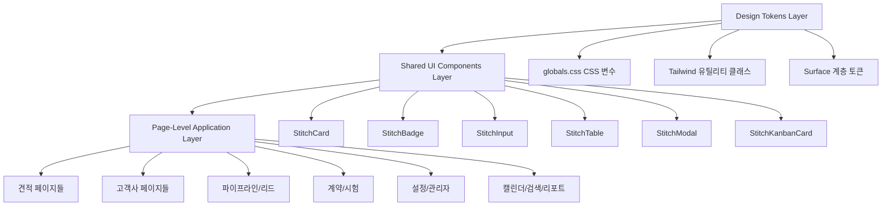
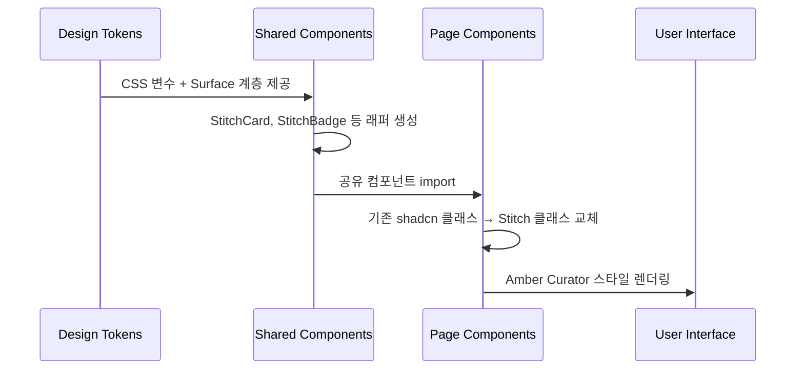
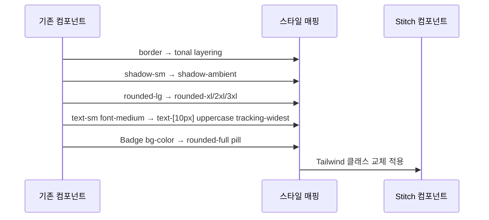

# Design Document: Stitch Amber Curator 디자인 시스템 전면 적용

## Overview

Chemon Management 프로젝트의 전체 UI를 Google Stitch AI 기반 "The Editorial Curator" 디자인 시스템으로 리뉴얼합니다. 이미 globals.css, Sidebar, Header, Dashboard, StatsCard, SalesDashboard KPI, Login 페이지에 적용이 완료되었으며, 나머지 18개 페이지/컴포넌트에 동일한 Amber Curator 디자인 토큰을 일관되게 적용하는 것이 목표입니다.

핵심 원칙은 "No-Line Rule" (1px 보더 금지, tonal layering으로 영역 구분), "Glass & Gradient" (backdrop-blur + gradient CTA), ambient shadow (blur 32-64px, opacity 4-6%), 그리고 editorial typography (font-black, uppercase tracking-widest 라벨)입니다. 기존 shadcn/ui 컴포넌트를 래핑하거나 Tailwind 클래스를 교체하는 방식으로 진행하며, 기능 로직은 변경하지 않습니다.

## Architecture

전체 디자인 시스템 적용은 3개 레이어로 구성됩니다:



## Sequence Diagrams

### 디자인 시스템 적용 워크플로우



### 컴포넌트 변환 패턴



## Components and Interfaces

### Component 1: StitchCard (공유 카드 래퍼)

**Purpose**: 모든 페이지에서 사용하는 카드 컴포넌트를 Stitch 스타일로 통일

```typescript
interface StitchCardProps {
  children: React.ReactNode;
  variant?: 'surface' | 'surface-low' | 'surface-container' | 'elevated';
  hover?: boolean;
  className?: string;
  padding?: 'sm' | 'md' | 'lg';
}
```

**Responsibilities**:
- No-Line Rule 적용: border 제거, tonal layering으로 영역 구분
- Surface 계층에 따른 배경색 자동 적용
- hover 시 translate-y-[-2px] + ambient shadow 트랜지션
- rounded-xl 기본, elevated는 rounded-2xl

### Component 2: StitchBadge (상태 뱃지)

**Purpose**: 견적 상태, 고객 등급, 파이프라인 단계 등의 뱃지를 pill 스타일로 통일

```typescript
interface StitchBadgeProps {
  children: React.ReactNode;
  variant: 'success' | 'warning' | 'error' | 'info' | 'neutral' | 'primary';
  size?: 'sm' | 'md';
}
```

**Responsibilities**:
- rounded-full + uppercase + tracking-wider
- 배경색은 연한 톤 (bg-emerald-50, bg-orange-50 등)
- 텍스트는 진한 톤 (text-emerald-600, text-orange-600 등)
- font-bold text-xs 고정

### Component 3: StitchInput (폼 인풋)

**Purpose**: 모든 폼 인풋을 Stitch 스타일로 통일

```typescript
interface StitchInputProps extends React.InputHTMLAttributes<HTMLInputElement> {
  label?: string;
}
```

**Responsibilities**:
- bg-surface-container-lowest (bg-[#FAF2E9] 또는 bg-white)
- border-none rounded-xl
- focus:ring-2 focus:ring-primary/40
- 라벨: text-[11px] font-bold uppercase tracking-widest

### Component 4: StitchTable (테이블)

**Purpose**: 견적 목록, 고객 목록 등의 테이블을 Stitch tonal layering 스타일로 변환

```typescript
interface StitchTableProps {
  children: React.ReactNode;
  className?: string;
}
```

**Responsibilities**:
- border-separate border-spacing-y-3 (행 간격)
- thead: text-[11px] font-bold uppercase tracking-widest text-slate-400
- tbody tr: bg-surface-container-low rounded-xl, hover:bg-[#FFF8F1]
- 1px 보더 제거, tonal layering으로 행 구분

### Component 5: StitchPageHeader (페이지 헤더)

**Purpose**: 각 페이지 상단 제목 영역을 editorial 타이포그래피로 통일

```typescript
interface StitchPageHeaderProps {
  title: string;
  description?: string;
  actions?: React.ReactNode;
  label?: string; // uppercase 라벨 (예: "QUOTATIONS")
}
```

**Responsibilities**:
- 라벨: text-[10px] font-bold uppercase tracking-widest text-slate-500
- 제목: text-2xl font-extrabold tracking-tight (또는 큰 페이지는 text-[2.75rem] font-black)
- 설명: text-sm text-slate-500

## Data Models

### Surface 계층 토큰 매핑

```typescript
type SurfaceLevel = 
  | 'surface'           // #FFF8F1 — 페이지 배경
  | 'surface-low'       // #FAF2E9 — 대형 콘텐츠 영역
  | 'surface-container' // #F5EDE3 — 내부 모듈, 카드
  | 'surface-high'      // #EFE7DD — 강조 영역
  | 'surface-highest'   // #E9E1D8 — 플로팅 오버레이

const SURFACE_COLORS: Record<SurfaceLevel, string> = {
  'surface':           'bg-[#FFF8F1]',
  'surface-low':       'bg-[#FAF2E9]',
  'surface-container': 'bg-[#F5EDE3]',
  'surface-high':      'bg-[#EFE7DD]',
  'surface-highest':   'bg-[#E9E1D8]',
};
```

### 상태 뱃지 색상 매핑

```typescript
const STATUS_BADGE_MAP: Record<string, { bg: string; text: string }> = {
  // 견적 상태
  DRAFT:    { bg: 'bg-slate-100',   text: 'text-slate-600' },
  SENT:     { bg: 'bg-blue-50',     text: 'text-blue-600' },
  ACCEPTED: { bg: 'bg-emerald-50',  text: 'text-emerald-600' },
  REJECTED: { bg: 'bg-red-50',      text: 'text-red-600' },
  EXPIRED:  { bg: 'bg-amber-50',    text: 'text-amber-600' },
  // 고객 등급
  LEAD:     { bg: 'bg-sky-50',      text: 'text-sky-600' },
  PROSPECT: { bg: 'bg-violet-50',   text: 'text-violet-600' },
  CUSTOMER: { bg: 'bg-emerald-50',  text: 'text-emerald-600' },
  VIP:      { bg: 'bg-orange-50',   text: 'text-orange-600' },
  INACTIVE: { bg: 'bg-slate-100',   text: 'text-slate-500' },
};
```

### 페이지별 변환 대상 매핑

```typescript
interface PageConversionTarget {
  path: string;
  components: string[];
  priority: 'high' | 'medium' | 'low';
  changes: string[];
}
```


## Algorithmic Pseudocode

### 스타일 변환 알고리즘

각 페이지/컴포넌트에 대해 동일한 변환 패턴을 적용합니다:

```typescript
function applyStitchStyle(component: ReactComponent): void {
  // Step 1: 보더 제거 → tonal layering
  // 기존: border border-border rounded-lg
  // 변환: bg-[#FAF2E9] rounded-xl (또는 rounded-2xl)
  replaceBorders(component);

  // Step 2: 그림자 변환
  // 기존: shadow-sm, shadow-md
  // 변환: shadow-ambient (blur 32-64px, opacity 4-6%)
  replaceShadows(component);

  // Step 3: 타이포그래피 변환
  // 라벨: text-[10px] font-bold uppercase tracking-widest
  // 제목: font-extrabold 또는 font-black tracking-tight
  // 값: text-2xl+ font-black tracking-tighter
  replaceTypography(component);

  // Step 4: 뱃지 변환
  // 기존: Badge variant="secondary" + bg-color
  // 변환: rounded-full uppercase tracking-wider + 연한 배경
  replaceBadges(component);

  // Step 5: 인풋 변환
  // 기존: border border-input rounded-md
  // 변환: bg-white border-none rounded-xl focus:ring-2 focus:ring-primary/40
  replaceInputs(component);

  // Step 6: 버튼 CTA 변환
  // Primary: bg-gradient-to-r from-primary to-orange-400 rounded-xl
  // Secondary: bg-white rounded-xl font-bold uppercase
  replaceButtons(component);
}
```

**Preconditions:**
- globals.css에 Amber Curator CSS 변수가 이미 설정됨
- Sidebar, Header가 이미 Stitch 스타일로 변환됨
- shadcn/ui 컴포넌트가 프로젝트에 설치됨

**Postconditions:**
- 모든 페이지가 동일한 Amber Curator 디자인 토큰 사용
- 1px 보더가 존재하지 않음 (No-Line Rule)
- 모든 카드가 tonal layering으로 영역 구분
- 기능 로직은 변경되지 않음

### 테이블 변환 알고리즘

```typescript
function convertTableToStitch(table: TableComponent): void {
  // Step 1: 외부 컨테이너
  // 기존: <div className="rounded-lg border">
  // 변환: <div className="bg-[#FAF2E9] rounded-[2.5rem] p-8">
  wrapWithSurfaceContainer(table);

  // Step 2: 테이블 헤더
  // 기존: <TableHead>텍스트</TableHead>
  // 변환: text-[11px] font-bold uppercase tracking-widest text-slate-400
  convertHeaders(table);

  // Step 3: 테이블 행
  // 기존: <TableRow> with border-b
  // 변환: hover:bg-[#FFF8F1] transition-colors, divide-y divide-slate-100
  convertRows(table);

  // Step 4: 셀 내 뱃지
  // 기존: <Badge className="bg-green-100 text-green-700">
  // 변환: <span className="text-xs font-bold text-emerald-600 bg-emerald-50 px-2 py-1 rounded-full">
  convertCellBadges(table);
}
```

**Preconditions:**
- 테이블이 shadcn/ui Table 컴포넌트 사용 중
- 데이터 바인딩 로직이 정상 동작

**Postconditions:**
- 테이블 외부 보더 제거, tonal layering 적용
- 헤더가 editorial uppercase 스타일
- 행 hover 시 따뜻한 배경색 전환

### 폼 섹션 변환 알고리즘

```typescript
function convertFormToStitch(form: FormComponent): void {
  // Step 1: 섹션 카드
  // 기존: <Card><CardContent>
  // 변환: <section className="bg-[#FAF2E9] rounded-xl p-8">
  convertSectionCards(form);

  // Step 2: 섹션 제목
  // 기존: <h2 className="text-lg font-semibold">
  // 변환: <h2 className="text-xl font-bold flex items-center gap-2">
  //        + 아이콘에 text-primary 적용
  convertSectionTitles(form);

  // Step 3: 라벨
  // 기존: <Label>텍스트</Label>
  // 변환: <label className="text-[11px] font-bold uppercase tracking-widest text-slate-500">
  convertLabels(form);

  // Step 4: 인풋 필드
  // 기존: <Input className="border ...">
  // 변환: <Input className="bg-white border-none rounded-xl focus:ring-2 focus:ring-primary/40">
  convertInputFields(form);

  // Step 5: Select 드롭다운
  // 기존: <SelectTrigger className="w-full">
  // 변환: <SelectTrigger className="bg-white border-none rounded-xl">
  convertSelects(form);
}
```

**Preconditions:**
- 폼이 shadcn/ui Form 컴포넌트 또는 직접 구현된 폼 사용
- 유효성 검증 로직이 정상 동작

**Postconditions:**
- 모든 폼 섹션이 surface-container-low 배경
- 인풋 필드가 border-none + rounded-xl
- 라벨이 uppercase tracking-widest 스타일

## Key Functions with Formal Specifications

### Function 1: getStitchCardClasses()

```typescript
function getStitchCardClasses(
  variant: SurfaceLevel = 'surface-low',
  hover: boolean = false,
  padding: 'sm' | 'md' | 'lg' = 'md'
): string
```

**Preconditions:**
- variant는 유효한 SurfaceLevel 값
- padding은 'sm' | 'md' | 'lg' 중 하나

**Postconditions:**
- 반환 문자열에 border 클래스가 포함되지 않음
- 반환 문자열에 rounded-xl 이상의 border-radius 포함
- hover=true일 때 hover:translate-y-[-2px] 포함

### Function 2: getStitchBadgeClasses()

```typescript
function getStitchBadgeClasses(
  status: string
): string
```

**Preconditions:**
- status는 STATUS_BADGE_MAP에 정의된 키

**Postconditions:**
- 반환 문자열에 rounded-full 포함
- 반환 문자열에 uppercase tracking-wider 포함
- 배경색과 텍스트색이 동일 색상 계열의 연한/진한 조합

### Function 3: getStitchInputClasses()

```typescript
function getStitchInputClasses(
  hasError: boolean = false
): string
```

**Preconditions:**
- hasError는 boolean

**Postconditions:**
- 반환 문자열에 border-none 포함
- 반환 문자열에 rounded-xl 포함
- hasError=true일 때 ring-red-500 관련 클래스 포함
- hasError=false일 때 focus:ring-primary/40 포함

## Example Usage

### 견적 목록 페이지 변환 예시

```typescript
// Before (기존)
<div className="rounded-lg border">
  <Table>
    <TableHeader>
      <TableRow>
        <TableHead>견적번호</TableHead>
        <TableHead>상태</TableHead>
      </TableRow>
    </TableHeader>
    <TableBody>
      <TableRow>
        <TableCell>Q-001</TableCell>
        <TableCell>
          <Badge className="bg-green-100 text-green-700">수주</Badge>
        </TableCell>
      </TableRow>
    </TableBody>
  </Table>
</div>

// After (Stitch 적용)
<div className="bg-[#FAF2E9] rounded-[2.5rem] p-8">
  <table className="w-full text-left">
    <thead>
      <tr className="text-slate-400">
        <th className="pb-6 font-bold text-[11px] uppercase tracking-widest">
          견적번호
        </th>
        <th className="pb-6 font-bold text-[11px] uppercase tracking-widest">
          상태
        </th>
      </tr>
    </thead>
    <tbody className="divide-y divide-slate-100">
      <tr className="group hover:bg-[#FFF8F1] transition-colors">
        <td className="py-5 font-bold text-primary">Q-001</td>
        <td className="py-5">
          <span className="text-xs font-bold text-emerald-600 bg-emerald-50 px-2.5 py-1 rounded-full uppercase tracking-wider">
            수주
          </span>
        </td>
      </tr>
    </tbody>
  </table>
</div>
```

### 폼 인풋 변환 예시

```typescript
// Before (기존)
<div>
  <Label>고객사</Label>
  <Select>
    <SelectTrigger className="w-full">
      <SelectValue placeholder="선택" />
    </SelectTrigger>
  </Select>
</div>

// After (Stitch 적용)
<div className="flex flex-col gap-2">
  <label className="text-[11px] font-bold uppercase tracking-widest text-slate-500">
    고객사
  </label>
  <Select>
    <SelectTrigger className="bg-white border-none rounded-xl px-4 py-3 focus:ring-2 focus:ring-primary/40">
      <SelectValue placeholder="선택" />
    </SelectTrigger>
  </Select>
</div>
```

### 칸반 카드 변환 예시

```typescript
// Before (기존)
<Card className="cursor-grab hover:shadow-md">
  <CardContent className="p-3">
    <Badge variant="outline">{amount}</Badge>
    <span className="font-medium">{companyName}</span>
  </CardContent>
</Card>

// After (Stitch 적용)
<div className="bg-white rounded-xl p-4 cursor-grab hover:translate-y-[-2px] transition-all duration-200 shadow-ambient">
  <span className="text-xs font-bold text-orange-600 bg-orange-50 px-2 py-1 rounded-full">
    {amount}
  </span>
  <span className="font-bold text-slate-900">{companyName}</span>
</div>
```

## Correctness Properties

*속성(Property)은 시스템의 모든 유효한 실행에서 참이어야 하는 특성 또는 동작입니다. 속성은 사람이 읽을 수 있는 명세와 기계가 검증 가능한 정확성 보장 사이의 다리 역할을 합니다.*

### Property 1: No-Line Rule 준수

*For any* 변환된 컴포넌트의 className 문자열에서, 레이아웃 구분용 보더 클래스(border, border-b, border-t, border-l, border-r, border-border)가 포함되지 않아야 하며, 고대비 그림자 클래스(shadow-lg, shadow-xl)도 포함되지 않아야 한다 (단, divide-y/divide-slate-100은 테이블 행 구분에 허용)

**Validates: Requirements 2.1, 9.4**

### Property 2: Surface Hierarchy 배경색 일관성

*For any* StitchCard variant 값에 대해, 렌더링된 컴포넌트의 배경색 클래스가 Surface_Hierarchy에 정의된 5개 색상(#FFF8F1, #FAF2E9, #F5EDE3, #EFE7DD, #E9E1D8) 중 하나에 해당해야 한다

**Validates: Requirements 1.2, 3.5**

### Property 3: Badge Pill 스타일 일관성

*For any* STATUS_BADGE_MAP에 정의된 상태 값에 대해, StitchBadge가 렌더링한 className에 rounded-full, uppercase, tracking-wider, font-bold, text-xs가 포함되어야 하며, 배경색과 텍스트색이 동일 색상 계열의 연한/진한 조합이어야 한다

**Validates: Requirements 1.4, 5.1, 5.2, 5.3**

### Property 4: Input Border-None 일관성

*For any* StitchInput 및 Select 드롭다운 트리거에 대해, 렌더링된 className에 border-none과 rounded-xl이 포함되어야 하며, 기존 border 클래스가 포함되지 않아야 한다

**Validates: Requirements 1.5, 6.1, 6.4**

### Property 5: Editorial Typography 일관성

*For any* 메타데이터 라벨 요소에 대해, className에 text-[10px] 또는 text-[11px], font-bold, uppercase, tracking-widest가 포함되어야 하며, 페이지 제목에는 font-extrabold 또는 font-black과 tracking-tight가 포함되어야 한다

**Validates: Requirements 4.1, 4.2**

### Property 6: 순수 검정 텍스트 금지

*For any* 변환된 컴포넌트의 텍스트 색상에서, 순수 검정(#000000, text-black)이 사용되지 않고 on-surface(#1E1B15) 또는 slate 계열 색상이 사용되어야 한다

**Validates: Requirement 4.4**

### Property 7: 기능 무결성 (데이터 렌더링 동일성)

*For any* 변환된 컴포넌트와 임의의 유효한 props 입력에 대해, 스타일 변환 전후의 데이터 콘텐츠(텍스트, 숫자, 상태 값)가 동일하게 렌더링되어야 한다

**Validates: Requirements 10.4, 11.5, 12.4, 13.4, 15.1, 15.3, 16.4**

## Error Handling

### Error Scenario 1: shadcn/ui 컴포넌트 오버라이드 충돌

**Condition**: shadcn/ui 기본 스타일과 Stitch 커스텀 클래스가 충돌할 때
**Response**: Tailwind의 className 우선순위를 활용하여 커스텀 클래스가 우선 적용되도록 함. cn() 유틸리티로 클래스 병합
**Recovery**: 충돌 시 shadcn/ui 컴포넌트의 기본 variant를 "unstyled"로 설정하고 Stitch 클래스를 직접 적용

### Error Scenario 2: 다크모드 호환성

**Condition**: Stitch 디자인 토큰이 다크모드에서 가독성 문제를 일으킬 때
**Response**: 다크모드는 현재 스코프 외. globals.css의 .dark 섹션은 기존 유지
**Recovery**: 추후 다크모드 Stitch 토큰 별도 정의 필요

### Error Scenario 3: 모바일 반응형 깨짐

**Condition**: rounded-[2.5rem] 등 큰 border-radius가 모바일에서 레이아웃을 깨뜨릴 때
**Response**: 모바일에서는 rounded-xl (0.75rem)로 축소, 데스크톱에서만 rounded-[2.5rem] 적용
**Recovery**: md: 프리픽스로 반응형 분기 (예: `rounded-xl md:rounded-[2.5rem]`)

## Testing Strategy

### Unit Testing Approach

- 각 Stitch 공유 컴포넌트(StitchCard, StitchBadge 등)의 렌더링 테스트
- className에 필수 Stitch 클래스가 포함되는지 검증
- variant별 올바른 Surface 색상 적용 검증

### Visual Regression Testing

- 각 페이지의 스크린샷 비교 (변환 전/후)
- 모바일/데스크톱 뷰포트별 레이아웃 검증
- 다크모드 미적용 확인

### Property-Based Testing Approach

**Property Test Library**: fast-check (TypeScript)

- No-Line Rule 검증: 렌더된 HTML에서 `border-border`, `border-b` 등의 레이아웃 보더 클래스 부재 확인
- Surface 계층 검증: 모든 카드 컴포넌트의 배경색이 SURFACE_COLORS에 포함되는지 확인
- 기능 무결성: 변환 전후 동일한 props에 대해 동일한 데이터 렌더링 확인

### Integration Testing Approach

- 전체 페이지 네비게이션 후 스타일 일관성 확인
- 필터/검색/페이지네이션 동작 후 Stitch 스타일 유지 확인
- 모달/다이얼로그 열기/닫기 시 스타일 정상 적용 확인

## Performance Considerations

- CSS 클래스 변경만으로 진행하므로 번들 사이즈 증가 최소화
- 새로운 공유 컴포넌트는 tree-shaking 가능하도록 개별 export
- rounded-[2.5rem] 등 커스텀 값은 Tailwind JIT로 처리되므로 추가 CSS 생성 최소
- ambient shadow는 GPU 가속 활용 (box-shadow는 레이아웃 리플로우 없음)

## Security Considerations

- 스타일 변경만 진행하므로 보안 영향 없음
- 기존 인증/인가 로직 변경 없음
- XSS 관련: className에 사용자 입력이 포함되지 않도록 주의

## Dependencies

- **기존 의존성 (변경 없음)**:
  - Next.js 14.2.3
  - TypeScript
  - Tailwind CSS
  - shadcn/ui (Radix UI)
  - lucide-react (아이콘)

- **참조 문서**:
  - `stitch_chemon_design_review_document/amber_curator/DESIGN.md`
  - `stitch_chemon_design_review_document/advanced_analytics_orange/code.html`
  - `stitch_chemon_design_review_document/create_new_quote_orange/code.html`
  - `.kiro/steering/design-guidelines.md` (Amber Curator 컨셉으로 갱신 완료)
