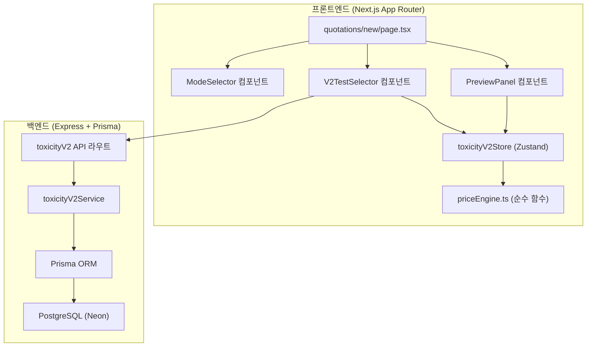
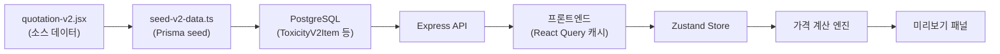
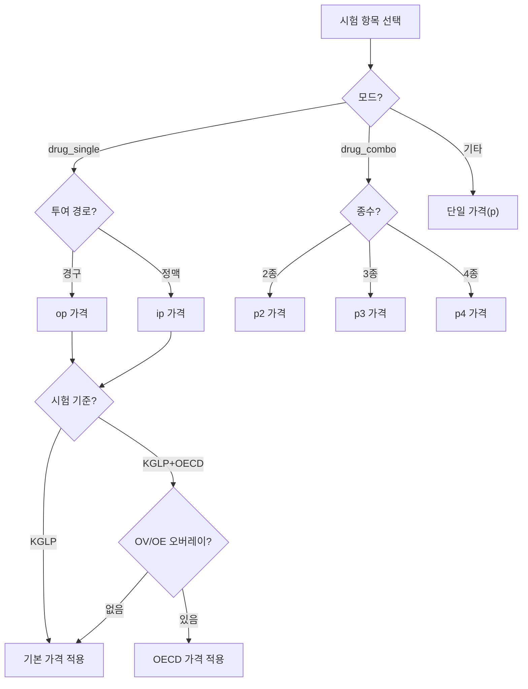

# 설계 문서: 독성시험 견적서 v2

## 개요

독성시험 견적서 v2는 기존 4단계 위자드(기본정보→시험선택→계산→미리보기)를 유지하면서, 시험선택 단계를 v2 모드 선택 + 실시간 미리보기 패널 구조로 전면 개편한다. 핵심 변경은 다음과 같다:

1. **데이터 레이어**: 기존 ToxicityTest 모델을 v2 구조로 확장하고, 9개 모드별 데이터셋 + 관계 트리 + 오버레이 가격을 DB에 저장
2. **가격 엔진**: 투여경로(op/ip), 시험기준(KGLP/OECD), 복합제 종수(p2/p3/p4), 함량분석 자동계산을 통합하는 순수 함수 기반 가격 계산 엔진
3. **UI 레이어**: 모드 선택 네비게이션 → 카테고리 필터 + 시험 항목 선택 → 실시간 미리보기 패널(표지/견적서/상세내역/전체)
4. **출력물**: 표지, 견적서 테이블, 상세내역, 전체보기 + 인쇄/PDF

## 아키텍처



## 컴포넌트 및 인터페이스

### 1. 데이터 타입 정의 (`types/toxicity-v2.ts`)

```typescript
// 시험 모드 열거형
type TestMode =
  | 'drug_single'    // 의약품
  | 'drug_combo'     // 복합제
  | 'drug_vaccine'   // 백신
  | 'drug_screen_tox'// 독성 스크리닝
  | 'drug_screen_cv' // 심혈관계 스크리닝
  | 'hf_indv'        // 건기식 개별인정형
  | 'hf_prob'        // 건기식 프로바이오틱스
  | 'hf_temp'        // 건기식 한시적식품
  | 'md_bio';        // 의료기기 생물학적안전성

// 투여 경로
type RouteType = 'oral' | 'iv'; // 경구 / 정맥

// 시험 기준
type StandardType = 'KGLP' | 'KGLP_OECD';

// 기본 시험 항목 (D 배열 구조)
interface ToxicityV2Item {
  id: number;
  num: number | null;
  name: string;           // n
  category: string;       // c
  species: string;        // s
  duration: string;       // d
  description: string;    // desc
  priceOral: number | null;    // op
  routeOral: string;           // or
  weeksOral: number | string;  // ow
  priceIv: number | null;      // ip
  routeIv: string;             // ir
  weeksIv: number | string;    // iw
  formalName?: string;         // FN 매핑
  guideline?: string[];        // GL 매핑
  note?: string;               // 비고
}

// 복합제 시험 항목
interface ComboItem {
  id: number;
  num: number;
  name: string;
  formalName: string;     // fn
  category: string;
  species: string;
  duration: string;
  description: string;
  priceP2: number;        // p2
  priceP3: number;        // p3
  priceP4: number;        // p4
  weeks: number | string;
  guideline: string[];
  note?: string;
}

// 건기식/백신/스크리닝/의료기기 시험 항목 (단일 가격)
interface SimpleItem {
  id: number;
  num: number;
  name: string;
  formalName: string;     // fn
  category: string;
  species: string;
  duration: string;
  description: string;
  price: number;          // p
  weeks: number | string;
  guideline: string[];
  note?: string;
}

// 시험 관계 트리 노드
interface TestRelationNode {
  mainTestId: number;
  recoveryTestId?: number;
  tkOptions?: TkOptionTree;
}

// TK 옵션 트리
interface TkOptionTree {
  [method: string]: {           // "채혈+분석" | "채혈만"
    [points: string]:           // "6pt" | "8pt"
      number                    // 시험 항목 ID (단순)
      | { [count: string]: number }; // "2회" | "3회" → 시험 항목 ID
  };
}

// OECD 가격 오버레이
interface OecdOverlay {
  [itemId: number]: {
    oop?: number;  // OECD 경구 가격
    oip?: number;  // OECD 정맥 가격
  };
}

// 카테고리 색상 매핑
interface CategoryColorMap {
  [category: string]: string;
}

// 선택된 시험 항목
interface SelectedTest {
  id: string;              // 고유 ID (uuid)
  itemId: number;          // 시험 항목 ID
  name: string;
  category: string;
  price: number;           // 계산된 가격
  isOption: boolean;       // 옵션 여부 (회복시험, TK)
  parentId?: string;       // 부모 시험 ID
  tkConfig?: {             // TK 선택 설정
    method: string;
    points: string;
    count?: string;
  };
}

// 견적서 정보
interface QuotationInfo {
  org: string;
  person: string;
  contact: string;
  email: string;
  purpose: string;
  substance: string;
  quotationNumber: string;
}
```

### 2. 가격 계산 엔진 (`lib/toxicity-v2/priceEngine.ts`)

순수 함수로 구현하여 테스트 용이성을 확보한다.

```typescript
// 시험 항목의 가격 조회
function getItemPrice(
  item: ToxicityV2Item,
  route: RouteType,
  standard: StandardType,
  ovOverlay: OecdOverlay,
  oeOverlay: OecdOverlay
): number | null

// 복합제 항목의 가격 조회
function getComboPrice(
  item: ComboItem,
  comboType: 2 | 3 | 4
): number

// 함량분석 횟수 계산
function calcContentCount(duration: string): number

// 조제물분석비 계산
function calcFormulationCost(
  selectedItems: SelectedTest[],
  mode: TestMode,
  allItems: ToxicityV2Item[],
  imMapping: Record<number, [number, number]>
): { assayBase: number; contentTotal: number; hfFormulation: number }

// 전체 견적 금액 계산
function calculateTotal(
  selectedItems: SelectedTest[],
  formulationCost: number,
  discountRate: number
): { subtotalTest: number; subtotalFormulation: number; discountAmount: number; totalAmount: number }
```

### 3. Zustand 스토어 (`stores/toxicityV2Store.ts`)

```typescript
interface ToxicityV2State {
  // 모드 및 옵션
  mode: TestMode | null;
  route: RouteType;
  standard: StandardType;
  comboType: 2 | 3 | 4;

  // 선택된 시험 항목
  selectedTests: SelectedTest[];

  // 견적서 정보
  info: QuotationInfo;

  // 할인
  discountRate: number;
  discountReason: string;

  // 미리보기 탭
  previewTab: 'cover' | 'quote' | 'detail' | 'all';

  // 계산된 값 (파생)
  subtotalTest: number;
  formulationCost: number;
  discountAmount: number;
  totalAmount: number;

  // 액션
  setMode: (mode: TestMode | null) => void;
  setRoute: (route: RouteType) => void;
  setStandard: (standard: StandardType) => void;
  setComboType: (type: 2 | 3 | 4) => void;
  addTest: (test: SelectedTest) => void;
  removeTest: (id: string) => void;
  toggleTest: (itemId: number, allItems: ToxicityV2Item[]) => void;
  setInfo: (info: Partial<QuotationInfo>) => void;
  setDiscountRate: (rate: number) => void;
  setPreviewTab: (tab: string) => void;
  recalculate: () => void;
  reset: () => void;
}
```

### 4. 프론트엔드 컴포넌트 구조

```
components/toxicity-v2/
├── ModeSelector.tsx          # 모드 선택 네비게이션 (3단계 계층)
├── V2TestSelector.tsx        # 시험 항목 선택 (카테고리 필터 + 검색 + 카드)
├── TestItemCard.tsx          # 개별 시험 항목 카드
├── TestRelationPanel.tsx     # 본시험→회복시험/TK 옵션 패널
├── SelectedTestList.tsx      # 선택된 시험 목록 사이드바
├── PreviewPanel.tsx          # 실시간 미리보기 패널
├── PreviewCover.tsx          # 표지 미리보기
├── PreviewQuote.tsx          # 견적서 테이블 미리보기
├── PreviewDetail.tsx         # 상세내역 미리보기
├── PriceOptionBar.tsx        # 투여경로/시험기준/종수 옵션 바
└── data/
    ├── toxicityData.ts       # D 배열 104개 항목
    ├── comboData.ts          # COMBO 9개 항목
    ├── vaccineData.ts        # VACCINE 3개 항목
    ├── screenData.ts         # SCREEN 8개 + CV_SCREEN 6개
    ├── healthFoodData.ts     # HF_INDV 7개 + HF_PROB 5개 + HF_TEMP 8개
    ├── medicalDeviceData.ts  # MD_BIO 18개 항목
    ├── relations.ts          # TR 트리, OPT_IDS
    ├── overlays.ts           # OV, OE 오버레이
    └── metadata.ts           # FN, GL, CC, IM, CATS 매핑
```

### 5. 백엔드 API

```typescript
// GET /api/toxicity-v2/items?mode={mode}
// 모드별 시험 항목 목록 조회

// GET /api/toxicity-v2/categories?mode={mode}
// 모드별 카테고리 목록 조회

// GET /api/toxicity-v2/relations
// 시험 관계 트리 조회

// GET /api/toxicity-v2/overlays
// OECD 가격 오버레이 조회

// GET /api/toxicity-v2/metadata
// FN, GL, CC 매핑 데이터 조회
```

### 6. Prisma 스키마 확장

```prisma
model ToxicityV2Item {
  id          String  @id @default(uuid())
  itemId      Int
  mode        String  // 시험 모드
  num         Int?
  name        String
  category    String
  species     String?
  duration    String?
  description String?
  priceOral   Decimal? @db.Decimal(15, 2)
  routeOral   String?
  weeksOral   String?
  priceIv     Decimal? @db.Decimal(15, 2)
  routeIv     String?
  weeksIv     String?
  // 복합제 전용
  priceP2     Decimal? @db.Decimal(15, 2)
  priceP3     Decimal? @db.Decimal(15, 2)
  priceP4     Decimal? @db.Decimal(15, 2)
  // 단일 가격 (건기식/백신/스크리닝/의료기기)
  priceSingle Decimal? @db.Decimal(15, 2)
  // 부가 데이터
  formalName  String?
  guideline   Json?    // string[]
  note        String?
  isActive    Boolean  @default(true)
  createdAt   DateTime @default(now())
  updatedAt   DateTime @updatedAt

  @@unique([mode, itemId])
  @@index([mode])
  @@index([category])
}

model ToxicityV2Relation {
  id             String @id @default(uuid())
  mainTestId     Int
  recoveryTestId Int?
  tkOptions      Json?  // TkOptionTree
  createdAt      DateTime @default(now())

  @@unique([mainTestId])
}

model ToxicityV2Overlay {
  id       String @id @default(uuid())
  type     String // 'OV' | 'OE'
  itemId   Int
  priceOop Decimal? @db.Decimal(15, 2)
  priceOip Decimal? @db.Decimal(15, 2)
  createdAt DateTime @default(now())

  @@unique([type, itemId])
}

model ToxicityV2Metadata {
  id    String @id @default(uuid())
  key   String @unique // 'FN' | 'GL' | 'CC' | 'IM' | 'CATS'
  value Json
  createdAt DateTime @default(now())
  updatedAt DateTime @updatedAt
}
```

## 데이터 모델

### 시험 데이터 흐름



### 모드별 데이터 매핑

| 모드 | 소스 배열 | 항목수 | 가격 구조 | 카테고리 |
|------|----------|--------|----------|---------|
| drug_single | D | 104 | op/ip | CATS (12개) |
| drug_combo | COMBO | 9 | p2/p3/p4 | COMBO_CATS (4개) |
| drug_vaccine | VACCINE | 3 | p (단일) | VACCINE_CATS (3개) |
| drug_screen_tox | SCREEN | 8 | p (단일) | SCREEN_CATS (6개) |
| drug_screen_cv | CV_SCREEN | 6 | p (단일) | CV_SCREEN_CATS (5개) |
| hf_indv | HF_INDV | 7 | p (단일) | HF_INDV_CATS (5개) |
| hf_prob | HF_PROB | 5 | p (단일) | HF_PROB_CATS (4개) |
| hf_temp | HF_TEMP | 8 | p (단일) | HF_TEMP_CATS (5개) |
| md_bio | MD_BIO | 18 | p (단일) | MD_BIO_CATS (7개) |

### 가격 결정 로직



## 정확성 속성 (Correctness Properties)


*정확성 속성(Correctness Property)은 시스템의 모든 유효한 실행에서 참이어야 하는 특성 또는 동작이다. 사람이 읽을 수 있는 명세와 기계가 검증할 수 있는 정확성 보장 사이의 다리 역할을 한다.*

### Property 1: 투여 경로별 가격 적용

*For any* 의약품 모드의 시험 항목과 투여 경로(경구/정맥), 가격 계산 엔진이 반환하는 가격은 해당 경로의 가격 필드(경구→op, 정맥→ip) 값과 동일해야 한다.

**Validates: Requirements 3.1, 3.2, 3.4**

### Property 2: OECD 오버레이 가격 대체

*For any* 의약품 모드의 시험 항목, KGLP+OECD 기준 선택 시 OV 또는 OE 오버레이에 해당하는 항목의 가격은 오버레이의 OECD 가격(oop/oip)으로 대체되고, 오버레이에 포함되지 않은 항목은 기본 가격을 유지해야 한다.

**Validates: Requirements 4.1, 4.2, 4.3, 4.5**

### Property 3: 복합제 종수별 가격 적용

*For any* 복합제 모드의 시험 항목과 종수(2/3/4), 가격 계산 엔진이 반환하는 가격은 해당 종수의 가격 필드(p2/p3/p4) 값과 동일해야 한다.

**Validates: Requirements 5.2, 5.3, 5.4, 5.5**

### Property 4: 함량분석 횟수 계산

*For any* 함량분석 대상 시험 항목(IM 매핑의 두 번째 값이 1), 함량분석 횟수는 투여기간을 주 단위로 변환 후 ceil(weeks/4)로 계산되며, 4주 미만인 경우 1회를 반환해야 한다.

**Validates: Requirements 6.1, 6.2**

### Property 5: 조제물분석비 계산

*For any* 의약품 모드의 선택된 시험 항목 집합, 조제물분석비는 (in vivo 존재 시 10,000,000원) + (in vitro 존재 시 10,000,000원) + (함량분석 대상 항목별 횟수 × 1,000,000원)의 합과 동일해야 한다.

**Validates: Requirements 6.5, 16.2**

### Property 6: 최종 합계 계산 항등식

*For any* 선택된 시험 항목 집합과 할인율, 최종 합계는 (시험비 소계 + 조제물분석비) × (1 - 할인율/100)과 동일해야 한다. 여기서 시험비 소계는 개별 항목 가격의 합이다.

**Validates: Requirements 16.1, 16.3, 16.4**

### Property 7: 모드별 데이터셋 매핑

*For any* 시험 모드, 해당 모드로 로딩되는 시험 항목은 모두 해당 모드의 카테고리 목록에 포함되는 카테고리를 가져야 하며, 항목 수는 모드별 정의된 수와 일치해야 한다.

**Validates: Requirements 2.2, 2.3, 2.4, 2.5, 2.6, 2.7, 2.8, 2.9, 2.10**

### Property 8: 시험 관계 트리 무결성

*For any* TR 트리에 정의된 본시험, 해당 본시험의 회복시험 ID(rec)와 TK 옵션 ID는 모두 D 배열에 존재하는 유효한 시험 항목 ID여야 한다.

**Validates: Requirements 7.1, 8.5**

### Property 9: 본시험 제거 시 연쇄 삭제

*For any* 선택된 시험 목록에서 본시험을 제거하면, 해당 본시험의 parentId를 가진 모든 옵션 항목(회복시험, TK)도 함께 제거되어야 한다.

**Validates: Requirements 7.3**

### Property 10: 카테고리 필터링 정확성

*For any* 카테고리 필터 선택, 필터링 결과의 모든 항목은 선택된 카테고리에 속해야 하며, 해당 카테고리의 모든 항목이 결과에 포함되어야 한다.

**Validates: Requirements 9.2**

### Property 11: 검색 필터링 정확성

*For any* 검색어, 필터링 결과의 모든 항목의 시험명(name)은 검색어를 포함해야 한다.

**Validates: Requirements 9.3**

### Property 12: 부가 데이터 완전성

*For any* 의약품 모드의 시험 항목(id 1~104), FN 매핑에 해당 id의 정식명칭이 존재하고, GL 매핑에 해당 id의 가이드라인 정보가 존재해야 한다.

**Validates: Requirements 10.1, 10.2**

### Property 13: 금액 포맷팅

*For any* 양의 정수 금액, 한국 원화 포맷 함수는 3자리마다 콤마를 삽입하고 "원" 접미사를 붙인 문자열을 반환해야 한다 (예: 79000000 → "79,000,000원").

**Validates: Requirements 3.5, 12.4**

### Property 14: 모바일 가격 축약 포맷팅

*For any* 양의 정수 금액, 모바일 축약 포맷 함수는 만원 단위로 변환하여 "만원" 접미사를 붙인 문자열을 반환해야 한다 (예: 79000000 → "7,900만원").

**Validates: Requirements 19.4**

### Property 15: 옵션 항목 숨김

*For any* 시험 항목 목록, OPT_IDS에 포함된 항목 ID는 기본 시험 목록에 표시되지 않아야 한다.

**Validates: Requirements 7.4**

### Property 16: 비자동 조제물분석 모드

*For any* 복합제, 백신, 스크리닝, 의료기기 모드의 선택된 시험 항목 집합, 자동 조제물분석비 계산 결과는 0이어야 한다.

**Validates: Requirements 16.6**

## 에러 처리

| 에러 상황 | 처리 방법 |
|----------|----------|
| 시험 데이터 API 로딩 실패 | 에러 메시지 표시 + 재시도 버튼 (React Query retry) |
| 가격이 null인 항목 선택 | "별도 협의" 표시, 합계 계산에서 제외 |
| 할인율 범위 초과 (0~100%) | 입력 검증으로 범위 제한 |
| 견적서 저장 실패 | 에러 토스트 + 로컬 스토리지 임시 저장 |
| PDF 생성 실패 | 에러 메시지 + 인쇄 기능으로 대체 안내 |
| 모드 전환 시 선택 항목 불일치 | 모드 변경 시 선택 항목 초기화 확인 다이얼로그 |

## 테스트 전략

### 단위 테스트 (Jest)

- 가격 계산 엔진의 각 함수에 대한 구체적 예시 테스트
- 함량분석 횟수 계산의 엣지 케이스 (단회, 1주, 4주, 13주, 26주)
- 금액 포맷팅 함수의 엣지 케이스 (0원, null, 매우 큰 금액)
- 모드별 데이터 로딩 및 카테고리 매핑 확인
- 시험 관계 트리 탐색 로직

### 속성 기반 테스트 (fast-check)

- 최소 100회 반복 실행
- 각 테스트에 설계 문서의 Property 번호를 태그로 포함
- 태그 형식: **Feature: toxicity-quotation-v2, Property {number}: {title}**
- 각 정확성 속성은 하나의 속성 기반 테스트로 구현

### 테스트 대상 우선순위

1. **가격 계산 엔진** (Property 1~6, 13, 14, 16): 핵심 비즈니스 로직
2. **데이터 무결성** (Property 7, 8, 12): 데이터 정합성
3. **필터링 로직** (Property 10, 11, 15): 사용자 인터랙션
4. **상태 관리** (Property 9): 연쇄 삭제 로직
