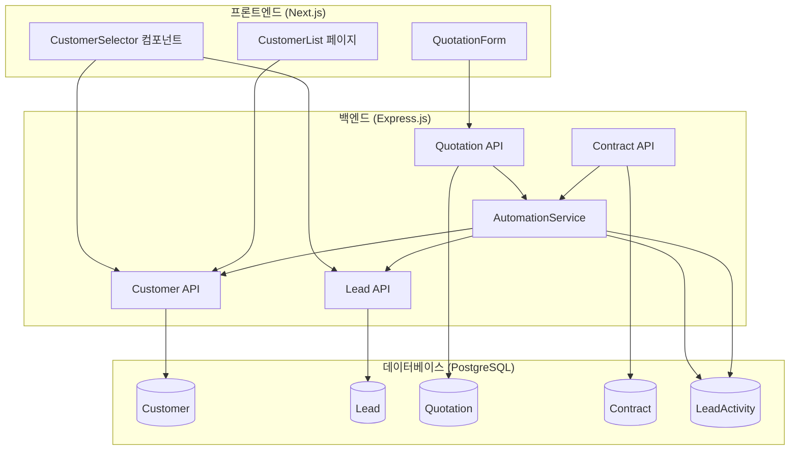
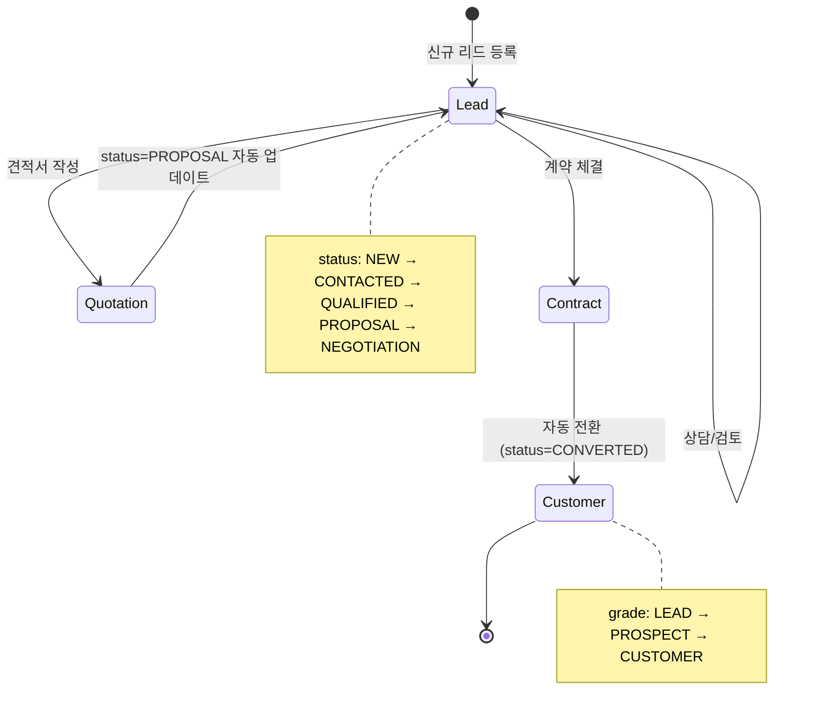

# 설계 문서: Unified CRM Flow Integration

## 개요

본 설계 문서는 견적 관리 시스템의 리드(Lead)와 고객(Customer) 관리를 통합된 CRM 플로우로 연결하는 기능의 기술적 설계를 정의합니다. 현재 분리된 리드 등록과 견적서 고객 등록을 통합하고, 영업 파이프라인 자동화 및 리드-고객 전환 프로세스를 구현합니다.

## 아키텍처



## 컴포넌트 및 인터페이스

### 1. CustomerSelector 컴포넌트 (신규)

견적서 작성 시 고객/리드를 선택하는 통합 컴포넌트입니다.

```typescript
// components/quotation/CustomerSelector.tsx

interface CustomerSelectorProps {
  selectedCustomerId: string | null;
  selectedLeadId: string | null;
  onCustomerSelect: (customerId: string, customerName: string) => void;
  onLeadSelect: (lead: Lead) => void;
  onNewCustomerCreate: (lead: Lead) => void;
}

interface CustomerSelectorState {
  activeTab: 'customers' | 'leads';
  customers: Customer[];
  leads: Lead[];
  isLoading: boolean;
  showNewCustomerDialog: boolean;
}
```

### 2. DetailedCustomerForm 컴포넌트 (신규)

리드 등록과 동일한 상세 입력 폼입니다.

```typescript
// components/quotation/DetailedCustomerForm.tsx

interface DetailedCustomerFormProps {
  onSubmit: (data: CreateLeadDTO) => void;
  onCancel: () => void;
  isLoading: boolean;
}

interface CreateLeadDTO {
  companyName: string;
  contactName: string;
  contactEmail?: string;
  contactPhone?: string;
  department?: string;
  position?: string;
  source: LeadSource;
  inquiryType?: QuotationType;
  inquiryDetail?: string;
  expectedAmount?: number;
  expectedDate?: string;
}
```

### 3. CustomerGradeBadge 컴포넌트 (신규)

고객 등급을 표시하는 배지 컴포넌트입니다.

```typescript
// components/customer/CustomerGradeBadge.tsx

interface CustomerGradeBadgeProps {
  grade: CustomerGrade;
  size?: 'sm' | 'md' | 'lg';
}

type CustomerGrade = 'LEAD' | 'PROSPECT' | 'CUSTOMER' | 'VIP' | 'INACTIVE';

const gradeConfig: Record<CustomerGrade, { label: string; color: string }> = {
  LEAD: { label: '리드', color: 'bg-gray-100 text-gray-700' },
  PROSPECT: { label: '잠재고객', color: 'bg-blue-100 text-blue-700' },
  CUSTOMER: { label: '고객', color: 'bg-green-100 text-green-700' },
  VIP: { label: 'VIP', color: 'bg-purple-100 text-purple-700' },
  INACTIVE: { label: '비활성', color: 'bg-red-100 text-red-700' },
};
```

### 4. Backend Services

#### 4.1 LeadConversionService (신규)

리드에서 고객으로의 전환을 처리하는 서비스입니다.

```typescript
// backend/src/services/leadConversionService.ts

interface LeadConversionService {
  convertLeadToCustomer(leadId: string, userId: string): Promise<ConversionResult>;
  syncLeadCustomerData(leadId: string, direction: 'lead-to-customer' | 'customer-to-lead'): Promise<void>;
}

interface ConversionResult {
  lead: Lead;
  customer: Customer;
  updatedQuotations: string[];
}
```

#### 4.2 PipelineAutomationService (확장)

파이프라인 자동화를 처리하는 서비스입니다.

```typescript
// backend/src/services/pipelineAutomationService.ts

interface PipelineAutomationService {
  onQuotationStatusChange(quotationId: string, newStatus: QuotationStatus): Promise<void>;
  onContractStatusChange(contractId: string, newStatus: ContractStatus): Promise<void>;
  updateLeadPipelineStage(leadId: string, stageCode: string): Promise<Lead>;
}
```

### 5. API 엔드포인트

#### 5.1 Customer API 확장

```typescript
// GET /api/customers
// 기존 파라미터에 grade 필터 추가
interface CustomerFilters {
  search?: string;
  grade?: CustomerGrade;  // 신규
  page?: number;
  limit?: number;
}

// Response에 grade 및 연결된 리드 정보 포함
interface CustomerWithLead extends Customer {
  grade: CustomerGrade;
  linkedLead?: {
    id: string;
    source: LeadSource;
    status: LeadStatus;
  };
}
```

#### 5.2 Lead API 확장

```typescript
// GET /api/leads
// 견적서 선택용 필터 추가
interface LeadFilters {
  status?: LeadStatus;
  stageId?: string;
  search?: string;
  excludeConverted?: boolean;  // 신규: 전환된 리드 제외
  page?: number;
  limit?: number;
}

// POST /api/leads/from-quotation
// 견적서에서 신규 리드 생성
interface CreateLeadFromQuotationDTO extends CreateLeadDTO {
  quotationId?: string;  // 연결할 견적서 ID
}
```

#### 5.3 Quotation API 확장

```typescript
// POST /api/quotations
// 리드 연결 지원
interface CreateQuotationDTO {
  // ... 기존 필드
  leadId?: string;  // 신규: 연결할 리드 ID
}

// PUT /api/quotations/:id/status
// 상태 변경 시 파이프라인 자동화 트리거
interface UpdateQuotationStatusDTO {
  status: QuotationStatus;
  triggerAutomation?: boolean;  // 기본값: true
}
```

## 데이터 모델

### 1. Customer 모델 확장

```prisma
model Customer {
  // ... 기존 필드
  grade     CustomerGrade @default(PROSPECT)
  
  // 연결된 리드 (역방향 관계)
  leads     Lead[]
}
```

### 2. Lead 모델 (기존 유지)

```prisma
model Lead {
  // ... 기존 필드
  customerId  String?
  customer    Customer? @relation(fields: [customerId], references: [id])
  convertedAt DateTime?
  
  // 연결된 견적서
  quotations  Quotation[]
}
```

### 3. Quotation 모델 확장

```prisma
model Quotation {
  // ... 기존 필드
  leadId    String?
  lead      Lead? @relation(fields: [leadId], references: [id])
}
```

### 4. 데이터 흐름




## 정확성 속성 (Correctness Properties)

*정확성 속성은 시스템의 모든 유효한 실행에서 참이어야 하는 특성 또는 동작입니다. 이는 사람이 읽을 수 있는 명세와 기계가 검증할 수 있는 정확성 보장 사이의 다리 역할을 합니다.*

### Property 1: 고객/리드 필터링 일관성

*For any* 고객 목록 조회 요청에서 grade 필터가 적용된 경우, 반환된 모든 고객의 grade는 요청된 필터 값과 일치해야 합니다. 마찬가지로, 리드 목록 조회에서 excludeConverted가 true인 경우, 반환된 모든 리드의 status는 CONVERTED가 아니어야 합니다.

**Validates: Requirements 1.2, 1.3, 4.3, 4.5**

### Property 2: 리드 선택 시 데이터 매핑 정확성

*For any* 리드 객체가 견적서 작성 시 선택되면, 견적서 폼에 채워지는 customerName은 리드의 companyName과 일치하고, 연락처 정보(contactName, contactEmail, contactPhone)도 리드의 해당 필드와 정확히 일치해야 합니다.

**Validates: Requirements 1.4**

### Property 3: 신규 리드 생성 및 견적서 연결

*For any* 견적서 작성 중 신규 고객 폼 제출 시, Lead 테이블에 새 레코드가 생성되고, 해당 리드의 id가 견적서의 leadId 필드에 저장되어야 합니다. 생성된 리드의 모든 필드는 폼에서 입력된 값과 일치해야 합니다.

**Validates: Requirements 1.6**

### Property 4: 견적서 발송 시 파이프라인 자동 업데이트

*For any* 리드가 연결된 견적서의 상태가 SENT로 변경될 때, 해당 리드의 현재 status가 PROPOSAL보다 이전 단계(NEW, CONTACTED, QUALIFIED)인 경우에만 리드의 status가 PROPOSAL로 변경되어야 합니다. 이미 PROPOSAL 이상의 단계(NEGOTIATION, CONVERTED)인 경우 status는 변경되지 않아야 합니다.

**Validates: Requirements 2.1, 2.2, 2.3**

### Property 5: 파이프라인 변경 시 활동 기록 생성

*For any* 리드의 status 또는 stageId가 자동으로 변경될 때, LeadActivity 테이블에 type이 "STATUS_CHANGE"인 새 레코드가 생성되어야 하고, 해당 레코드의 leadId는 변경된 리드의 id와 일치해야 합니다.

**Validates: Requirements 2.4**

### Property 6: 리드-고객 전환 데이터 무결성

*For any* 리드가 CONVERTED 상태로 전환될 때 (기존에 연결된 Customer가 없는 경우), 새로 생성된 Customer 레코드는 다음 조건을 만족해야 합니다:
- Customer.company = Lead.companyName
- Customer.name = Lead.contactName
- Customer.email = Lead.contactEmail
- Customer.phone = Lead.contactPhone
- Customer.grade = 'CUSTOMER'
- Lead.customerId = Customer.id
- Lead.convertedAt은 null이 아니어야 함

**Validates: Requirements 3.2, 3.3, 3.4**

### Property 7: 전환 시 견적서 연결 업데이트

*For any* 리드가 고객으로 전환될 때, 해당 리드에 연결된 모든 견적서(Quotation.leadId = Lead.id)의 customerId는 새로 생성된(또는 기존) Customer의 id로 업데이트되어야 합니다.

**Validates: Requirements 3.5**

### Property 8: 중복 고객 생성 방지

*For any* 리드 전환 시 해당 리드에 이미 customerId가 설정되어 있는 경우, 새로운 Customer 레코드가 생성되지 않아야 하고, 기존 Customer의 정보만 업데이트되어야 합니다.

**Validates: Requirements 3.6**

### Property 9: 고객 카드 리드 정보 표시

*For any* 고객 목록에서 표시되는 고객 중 연결된 리드(Lead.customerId = Customer.id)가 존재하는 경우, 해당 고객 카드에는 리드의 source 정보가 포함되어야 합니다.

**Validates: Requirements 4.4**

### Property 10: 리드-고객 양방향 동기화

*For any* 리드 정보(contactName, companyName, contactEmail, contactPhone) 수정 시 연결된 Customer가 존재하면, Customer의 해당 필드(name, company, email, phone)도 동일한 값으로 업데이트되어야 합니다. 역방향도 마찬가지로, Customer 정보 수정 시 연결된 Lead의 해당 필드도 업데이트되어야 합니다.

**Validates: Requirements 5.1, 5.2**

### Property 11: 동기화 로그 기록

*For any* 리드-고객 데이터 동기화가 발생할 때, ActivityLog 테이블에 action이 "SYNC"인 새 레코드가 생성되어야 합니다.

**Validates: Requirements 5.3**

### Property 12: 동기화 충돌 해결

*For any* 리드와 고객이 동시에 수정된 경우(양쪽 모두 updatedAt이 마지막 동기화 이후 변경됨), 더 최근의 updatedAt을 가진 레코드의 데이터가 다른 레코드에 적용되어야 합니다.

**Validates: Requirements 5.4**

## 오류 처리

### 1. 견적서 고객 선택 오류

| 오류 상황 | 처리 방법 |
|----------|----------|
| 고객/리드 목록 로딩 실패 | 재시도 버튼과 함께 오류 메시지 표시 |
| 선택한 리드가 이미 전환됨 | "이미 고객으로 전환된 리드입니다" 메시지 표시 |
| 신규 고객 생성 실패 | 폼 데이터 유지하고 오류 메시지 표시 |

### 2. 파이프라인 자동화 오류

| 오류 상황 | 처리 방법 |
|----------|----------|
| 리드 상태 업데이트 실패 | 견적서 상태는 변경하고, 리드 업데이트 실패 로그 기록 |
| PipelineStage 조회 실패 | 기본 단계로 폴백, 오류 로그 기록 |
| 활동 기록 생성 실패 | 주요 작업은 완료하고, 로그 생성 실패만 기록 |

### 3. 리드-고객 전환 오류

| 오류 상황 | 처리 방법 |
|----------|----------|
| Customer 생성 실패 | 트랜잭션 롤백, 리드 상태 유지 |
| 견적서 업데이트 실패 | 부분 성공 허용, 실패한 견적서 ID 로그 기록 |
| 동기화 충돌 | 최신 데이터 우선 적용, 충돌 내역 로그 기록 |

### 4. 데이터 동기화 오류

| 오류 상황 | 처리 방법 |
|----------|----------|
| 연결된 레코드 없음 | 동기화 스킵, 정상 완료 처리 |
| 업데이트 실패 | 원본 데이터 유지, 오류 로그 기록 |
| 동시 수정 감지 | 최신 updatedAt 기준으로 해결 |

## 테스트 전략

### 1. 단위 테스트

단위 테스트는 특정 예제, 엣지 케이스, 오류 조건을 검증합니다.

#### 프론트엔드 컴포넌트 테스트
- CustomerSelector 컴포넌트 렌더링 테스트
- DetailedCustomerForm 유효성 검사 테스트
- CustomerGradeBadge 각 grade별 렌더링 테스트
- 탭 전환 및 선택 이벤트 테스트

#### 백엔드 서비스 테스트
- LeadConversionService.convertLeadToCustomer 성공/실패 케이스
- PipelineAutomationService.onQuotationStatusChange 상태별 동작
- 데이터 동기화 서비스 충돌 해결 로직

### 2. 속성 기반 테스트 (Property-Based Testing)

속성 기반 테스트는 모든 유효한 입력에 대해 보편적 속성을 검증합니다. 각 테스트는 최소 100회 반복 실행됩니다.

#### 테스트 라이브러리
- Backend: fast-check (TypeScript/JavaScript)
- Frontend: @fast-check/vitest

#### 속성 테스트 목록

```typescript
// Feature: unified-crm-flow, Property 1: 고객/리드 필터링 일관성
describe('Customer/Lead Filtering Consistency', () => {
  it.prop([fc.constantFrom('LEAD', 'PROSPECT', 'CUSTOMER', 'VIP', 'INACTIVE')])(
    'should return only customers matching the grade filter',
    async (grade) => {
      // 테스트 구현
    }
  );
});

// Feature: unified-crm-flow, Property 4: 견적서 발송 시 파이프라인 자동 업데이트
describe('Quotation Send Pipeline Automation', () => {
  it.prop([leadArbitrary, quotationArbitrary])(
    'should update lead status to PROPOSAL only when current status is earlier',
    async (lead, quotation) => {
      // 테스트 구현
    }
  );
});

// Feature: unified-crm-flow, Property 6: 리드-고객 전환 데이터 무결성
describe('Lead to Customer Conversion Data Integrity', () => {
  it.prop([leadArbitrary])(
    'should correctly copy all lead fields to customer on conversion',
    async (lead) => {
      // 테스트 구현
    }
  );
});

// Feature: unified-crm-flow, Property 10: 리드-고객 양방향 동기화
describe('Lead-Customer Bidirectional Sync', () => {
  it.prop([leadArbitrary, customerUpdateArbitrary])(
    'should sync changes bidirectionally between lead and customer',
    async (lead, update) => {
      // 테스트 구현
    }
  );
});
```

### 3. 통합 테스트

- 견적서 작성 → 리드 선택 → 견적서 발송 → 파이프라인 업데이트 전체 플로우
- 계약 체결 → 리드 전환 → 고객 생성 → 견적서 연결 업데이트 전체 플로우
- 고객 목록 필터링 및 리드 정보 표시 통합 테스트

### 4. E2E 테스트

- 견적서 작성 화면에서 고객/리드 선택 UI 플로우
- 고객 목록 화면에서 필터링 및 배지 표시 확인
- 전체 CRM 플로우 (리드 등록 → 견적서 → 계약 → 고객 전환) 시나리오
