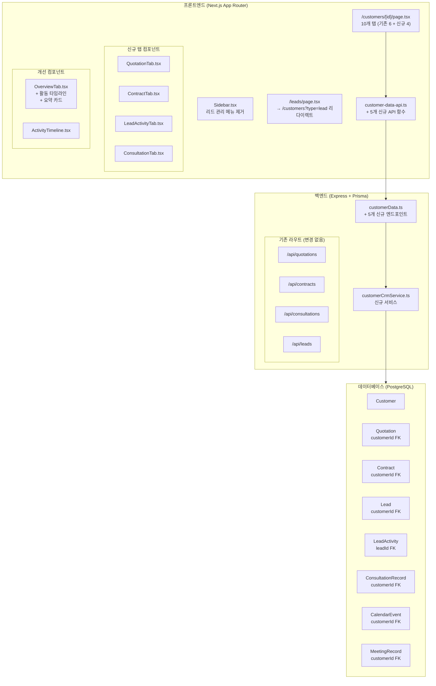
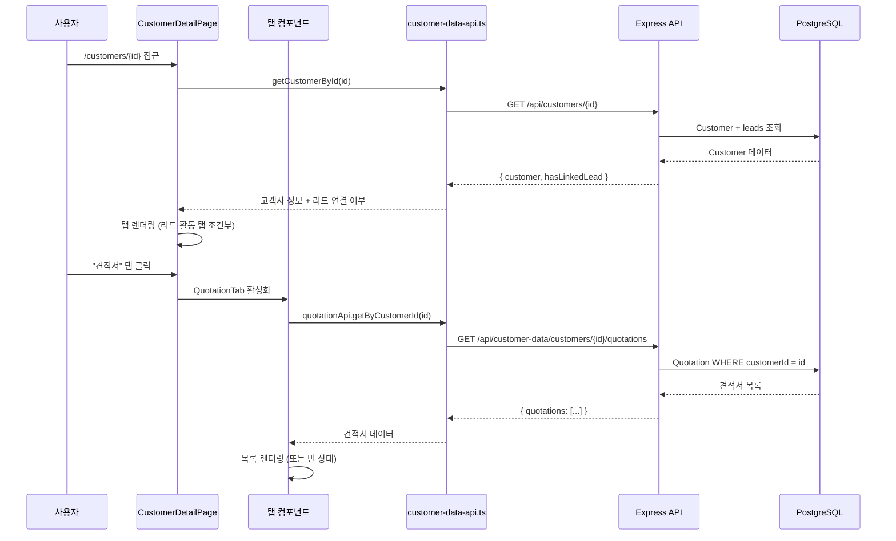

# 설계 문서: 통합 CRM 허브 - 고객사 중심 데이터 연동

## 개요

본 설계는 현재 분리된 리드 관리(`/leads`)와 고객사 관리(`/customers`)를 하나의 통합 모듈로 합치고, 고객사 상세 페이지(`/customers/[id]`)에서 견적서·계약·리드 활동·상담기록 등 모든 CRM 데이터를 탭 기반으로 조회할 수 있도록 하는 통합 CRM 허브를 구축한다.

핵심 변경 사항:
- 사이드바에서 "리드 관리" 메뉴 제거, `/leads` → `/customers?type=lead` 리다이렉트
- 고객사 상세 페이지에 4개 신규 탭 추가 (견적서, 계약, 리드 활동, 상담기록)
- 개요 탭에 통합 활동 타임라인 및 요약 카드 추가
- 백엔드에 고객사 하위 데이터 조회 API 5개 추가
- 기존 DB 외래키(customerId)를 활용한 양방향 연동 (스키마 변경 없음)

## 아키텍처

### 전체 구조



### 설계 원칙

1. **기존 스키마 활용**: Quotation, Contract, Lead, ConsultationRecord 등은 이미 `customerId` FK를 가지고 있으므로 스키마 변경 없이 조회 API만 추가
2. **읽기 전용 탭**: 신규 탭들은 데이터 조회만 수행하며, 생성/수정은 각 모듈의 기존 페이지에서 처리
3. **지연 로딩**: 탭 전환 시에만 해당 데이터를 로드하여 초기 로딩 성능 유지
4. **조건부 탭 표시**: 리드 활동 탭은 해당 고객사에 연결된 리드가 있을 때만 표시


## 컴포넌트 및 인터페이스

### 1. 사이드바 변경 (Sidebar.tsx)

**변경 내용**: `menuGroups` 배열에서 영업관리 그룹의 "리드 관리" 항목 제거

```typescript
// 변경 전
items: [
  { title: '리드 관리', href: '/leads', icon: UserPlus },
  { title: '파이프라인', href: '/pipeline', icon: Kanban },
  { title: '고객사 관리', href: '/customers', icon: Users },
  { title: '매출 대시보드', href: '/sales', icon: TrendingUp },
]

// 변경 후
items: [
  { title: '파이프라인', href: '/pipeline', icon: Kanban },
  { title: '고객사 관리', href: '/customers', icon: Users },
  { title: '매출 대시보드', href: '/sales', icon: TrendingUp },
]
```

### 2. 리드 페이지 리다이렉트 (/leads/page.tsx)

**변경 내용**: 기존 리드 관리 페이지를 `/customers?type=lead`로 리다이렉트하는 페이지로 교체

```typescript
// app/(dashboard)/leads/page.tsx
'use client';
import { useEffect } from 'react';
import { useRouter } from 'next/navigation';

export default function LeadsRedirectPage() {
  const router = useRouter();
  useEffect(() => {
    router.replace('/customers?type=lead');
  }, [router]);
  return null;
}
```

### 3. 고객사 상세 페이지 탭 확장 (/customers/[id]/page.tsx)

**변경 내용**: TabType 확장 및 4개 신규 탭 추가, 리드 활동 탭 조건부 표시

```typescript
// 변경 전
type TabType = 'overview' | 'calendar' | 'meetings' | 'tests' | 'invoices' | 'requesters';

// 변경 후
type TabType = 'overview' | 'calendar' | 'meetings' | 'tests' | 'invoices' | 'requesters'
  | 'quotations' | 'contracts' | 'lead-activities' | 'consultations';
```

리드 활동 탭 조건부 표시 로직:
- 고객사 로드 시 `GET /api/customer-data/customers/:id/lead-activities` 호출하여 연결된 리드 존재 여부 확인
- 또는 Customer 모델의 `leads` 관계를 통해 리드 존재 여부를 고객사 조회 시 함께 반환
- 리드가 없으면 탭 자체를 렌더링하지 않음

### 4. 신규 탭 컴포넌트

#### 4.1 QuotationTab.tsx

**위치**: `chemon-quotation/components/customer-detail/QuotationTab.tsx`

```typescript
interface QuotationTabProps {
  customerId: string;
}

// 표시 항목: 견적번호, 견적유형(독성/효력/임상병리), 프로젝트명, 상태, 총액, 생성일
// 빈 상태: "등록된 견적서가 없습니다"
// 클릭 시: 견적서 상세 페이지로 이동 (/quotations/{id} 또는 /clinical-pathology/quotations/{id})
```

견적서 유형별 라우팅:
- TOXICITY → `/quotations/{id}`
- EFFICACY → `/efficacy-quotations/{id}`
- CLINICAL_PATHOLOGY → `/clinical-pathology/quotations/{id}`

#### 4.2 ContractTab.tsx

**위치**: `chemon-quotation/components/customer-detail/ContractTab.tsx`

```typescript
interface ContractTabProps {
  customerId: string;
}

// 표시 항목: 계약번호, 계약유형, 제목, 상태, 계약금액, 시작일, 종료일
// 빈 상태: "등록된 계약이 없습니다"
// 클릭 시: /contracts/{contractId}로 이동
```

#### 4.3 LeadActivityTab.tsx

**위치**: `chemon-quotation/components/customer-detail/LeadActivityTab.tsx`

```typescript
interface LeadActivityTabProps {
  customerId: string;
}

// 리드 요약 카드: 리드번호, 소스, 현재 상태, 파이프라인 단계, 예상금액, 전환일
// 활동 이력: 시간순 정렬 (CALL, EMAIL, MEETING, NOTE)
// 이 탭은 연결된 리드가 있을 때만 표시됨
```

#### 4.4 ConsultationTab.tsx

**위치**: `chemon-quotation/components/customer-detail/ConsultationTab.tsx`

```typescript
interface ConsultationTabProps {
  customerId: string;
}

// 표시 항목: 상담일, 상담번호, 물질명, 상담내용 요약, 내부 메모
// 빈 상태: "등록된 상담기록이 없습니다"
```

### 5. 개요 탭 개선 (OverviewTab.tsx)

**변경 내용**: 기존 4개 카드(기본 정보, 진행 단계, 최근 미팅, 다가오는 일정) 외에 3개 섹션 추가

추가 섹션:
1. **견적서 요약 카드**: 총 건수, 최근 견적서 정보
2. **계약 요약 카드**: 총 건수, 활성 계약 건수
3. **최근 활동 타임라인**: 모든 CRM 활동을 시간순으로 통합하여 최근 10건 표시

#### 5.1 ActivityTimeline 컴포넌트

**위치**: `chemon-quotation/components/customer-detail/ActivityTimeline.tsx`

```typescript
interface TimelineItem {
  id: string;
  type: 'quotation' | 'contract' | 'meeting' | 'calendar_event' | 'lead_activity' | 'consultation';
  title: string;
  description: string;
  date: string;
  metadata?: Record<string, any>;
}

interface ActivityTimelineProps {
  items: TimelineItem[];
  onItemClick: (item: TimelineItem) => void;
}
```

각 활동 유형별 아이콘:
- quotation: `FileText`
- contract: `FileSignature`
- meeting: `Users`
- calendar_event: `Calendar`
- lead_activity: `UserPlus`
- consultation: `MessageSquare`

### 6. API 클라이언트 확장 (customer-data-api.ts)

**추가 함수**:

```typescript
// 견적서 목록 조회
export const quotationApi = {
  getByCustomerId: (customerId: string) => Promise<CustomerQuotation[]>,
};

// 계약 목록 조회
export const contractApi = {
  getByCustomerId: (customerId: string) => Promise<CustomerContract[]>,
};

// 리드 활동 조회
export const leadActivityApi = {
  getByCustomerId: (customerId: string) => Promise<LeadActivityData>,
};

// 상담기록 조회
export const consultationApi = {
  getByCustomerId: (customerId: string) => Promise<ConsultationRecord[]>,
};

// 통합 활동 타임라인 조회
export const activityTimelineApi = {
  getByCustomerId: (customerId: string) => Promise<TimelineItem[]>,
};
```

### 7. 백엔드 API 엔드포인트 (customerData.ts)

**추가 라우트** (기존 `customerData.ts`에 추가):

| 엔드포인트 | 메서드 | 설명 |
|---|---|---|
| `/customers/:id/quotations` | GET | 고객사 견적서 목록 (독성+효력+임상병리 통합) |
| `/customers/:id/contracts` | GET | 고객사 계약 목록 |
| `/customers/:id/lead-activities` | GET | 고객사 연결 리드의 활동 이력 |
| `/customers/:id/consultations` | GET | 고객사 상담기록 목록 |
| `/customers/:id/activity-timeline` | GET | 통합 활동 타임라인 (최근 10건) |

### 8. 백엔드 서비스 (customerCrmService.ts)

**위치**: `backend/src/services/customerCrmService.ts`

```typescript
export class CustomerCrmService {
  // 고객사 견적서 조회 (Quotation + ClinicalQuotation 통합)
  static async getQuotationsByCustomerId(customerId: string): Promise<CustomerQuotation[]>;
  
  // 고객사 계약 조회
  static async getContractsByCustomerId(customerId: string): Promise<CustomerContract[]>;
  
  // 고객사 리드 활동 조회 (Lead → LeadActivity)
  static async getLeadActivitiesByCustomerId(customerId: string): Promise<LeadActivityData | null>;
  
  // 고객사 상담기록 조회
  static async getConsultationsByCustomerId(customerId: string): Promise<ConsultationRecord[]>;
  
  // 통합 활동 타임라인 (최근 10건)
  static async getActivityTimeline(customerId: string): Promise<TimelineItem[]>;
}
```

**타임라인 집계 로직**:
1. 병렬로 6개 테이블 조회 (Quotation, Contract, MeetingRecord, CalendarEvent, LeadActivity, ConsultationRecord)
2. 각 항목을 `TimelineItem` 형태로 변환
3. `date` 기준 내림차순 정렬
4. 상위 10건 반환

## 데이터 모델

### 프론트엔드 타입 정의

```typescript
// types/customer-crm.ts

// 견적서 탭용 타입
export interface CustomerQuotation {
  id: string;
  quotationNumber: string;
  quotationType: 'TOXICITY' | 'EFFICACY' | 'CLINICAL_PATHOLOGY';
  projectName: string;
  status: string;
  totalAmount: number;
  createdAt: string;
  customerName: string;
}

// 계약 탭용 타입
export interface CustomerContract {
  id: string;
  contractNumber: string;
  contractType: string;
  title: string;
  status: string;
  totalAmount: number;
  signedDate: string | null;
  startDate: string | null;
  endDate: string | null;
}

// 리드 활동 탭용 타입
export interface LeadActivityData {
  lead: {
    id: string;
    leadNumber: string;
    source: string;
    status: string;
    stageName: string;
    expectedAmount: number | null;
    convertedAt: string | null;
    companyName: string;
    contactName: string;
  };
  activities: LeadActivityItem[];
}

export interface LeadActivityItem {
  id: string;
  type: string; // CALL, EMAIL, MEETING, NOTE
  subject: string;
  content: string;
  contactedAt: string;
  nextAction: string | null;
  nextDate: string | null;
  userName: string;
}

// 상담기록 탭용 타입
export interface CustomerConsultation {
  id: string;
  recordNumber: string;
  consultDate: string;
  substanceName: string | null;
  clientRequests: string | null;
  internalNotes: string | null;
  contractNumber: string | null;
}

// 통합 활동 타임라인 타입
export interface TimelineItem {
  id: string;
  type: 'quotation' | 'contract' | 'meeting' | 'calendar_event' | 'lead_activity' | 'consultation';
  title: string;
  description: string;
  date: string;
  metadata?: Record<string, any>;
}
```

### 백엔드 응답 형식

모든 API 응답은 기존 패턴을 따름:

```typescript
// 성공 응답
{
  success: true,
  data: {
    quotations: CustomerQuotation[]  // 또는 contracts, activities 등
  }
}

// 리드 활동 응답 (리드가 없는 경우)
{
  success: true,
  data: {
    lead: null,
    activities: []
  }
}

// 타임라인 응답
{
  success: true,
  data: {
    timeline: TimelineItem[]
  }
}
```

### 데이터 흐름



## 정확성 속성 (Correctness Properties)

*속성(Property)이란 시스템의 모든 유효한 실행에서 참이어야 하는 특성 또는 동작을 의미합니다. 속성은 사람이 읽을 수 있는 명세와 기계가 검증할 수 있는 정확성 보장 사이의 다리 역할을 합니다.*

### Property 1: 견적서 customerId 필터링

*For any* 고객사 ID에 대해, 견적서 조회 API(`/customers/:id/quotations`)가 반환하는 모든 견적서의 `customerId`는 요청된 고객사 ID와 일치해야 하며, 독성·효력·임상병리 모든 유형이 포함되어야 한다.

**Validates: Requirements 3.2, 8.2, 8.3, 11.1**

### Property 2: 계약 customerId 필터링

*For any* 고객사 ID에 대해, 계약 조회 API(`/customers/:id/contracts`)가 반환하는 모든 계약의 `customerId`는 요청된 고객사 ID와 일치해야 한다.

**Validates: Requirements 4.2, 10.2, 11.2**

### Property 3: 상담기록 customerId 필터링

*For any* 고객사 ID에 대해, 상담기록 조회 API(`/customers/:id/consultations`)가 반환하는 모든 상담기록의 `customerId`는 요청된 고객사 ID와 일치해야 한다.

**Validates: Requirements 6.2, 11.4**

### Property 4: 리드 활동 탭 조건부 표시

*For any* 고객사에 대해, 리드 활동 탭은 해당 고객사에 연결된 리드(`leads` 관계)가 1개 이상 존재할 때만 표시되어야 하며, 연결된 리드가 없으면 탭이 표시되지 않아야 한다.

**Validates: Requirements 5.1, 5.5**

### Property 5: 리드 활동 시간순 정렬

*For any* 고객사의 리드 활동 목록에 대해, 반환된 활동 항목들은 `contactedAt` 기준으로 시간순(내림차순)으로 정렬되어 있어야 한다.

**Validates: Requirements 5.4**

### Property 6: 통합 활동 타임라인 집계 및 정렬

*For any* 고객사에 대해, 활동 타임라인 API(`/customers/:id/activity-timeline`)가 반환하는 항목들은 (1) 날짜 기준 내림차순으로 정렬되어 있어야 하고, (2) 최대 10건으로 제한되어야 하며, (3) 견적서·계약·미팅·캘린더·리드활동·상담기록 중 해당 고객사에 존재하는 모든 유형의 데이터를 포함해야 한다.

**Validates: Requirements 7.2, 11.5**

### Property 7: 타임라인 항목 필수 필드

*For any* 타임라인 항목에 대해, 해당 항목은 반드시 `type`(활동 유형), `date`(발생 일시), `title`(요약 내용) 필드를 포함해야 하며, `type`은 'quotation', 'contract', 'meeting', 'calendar_event', 'lead_activity', 'consultation' 중 하나여야 한다.

**Validates: Requirements 7.3, 11.6**

### Property 8: 리드 → 고객사 자동 생성

*For any* `customerId`가 없는 리드에 대해, 고객사 자동 생성 프로세스를 실행하면 (1) 새로운 Customer 레코드가 생성되어야 하고, (2) 해당 리드의 `customerId`가 생성된 고객사 ID로 업데이트되어야 하며, (3) 리드의 `companyName`, `contactName` 등이 고객사 정보로 복사되어야 한다.

**Validates: Requirements 2.2**

### Property 9: 탭 데이터 캐싱

*For any* 탭에 대해, 한 번 로딩된 데이터는 캐싱되어 동일 탭으로 재전환 시 API를 재호출하지 않아야 한다. 즉, 탭 A → 탭 B → 탭 A 전환 시 탭 A의 API 호출 횟수는 1회여야 한다.

**Validates: Requirements 12.4**

### Property 10: API 오류 시 재시도 가능

*For any* API 호출 실패에 대해, 해당 탭은 오류 메시지를 표시하고 재시도 버튼을 제공해야 하며, 재시도 버튼 클릭 시 동일 API를 다시 호출해야 한다.

**Validates: Requirements 12.2**

## 오류 처리

### 백엔드 오류 처리

| 시나리오 | HTTP 상태 | 응답 |
|---|---|---|
| 존재하지 않는 customerId | 404 | `{ success: false, message: "고객사를 찾을 수 없습니다" }` |
| 서버 내부 오류 | 500 | `{ success: false, message: "서버 오류가 발생했습니다" }` |
| 인증 실패 | 401 | `{ success: false, message: "인증이 필요합니다" }` |
| 리드 활동 조회 시 연결된 리드 없음 | 200 | `{ success: true, data: { lead: null, activities: [] } }` |

### 프론트엔드 오류 처리

각 탭 컴포넌트는 동일한 오류 처리 패턴을 따름:

```typescript
// 공통 탭 데이터 로딩 패턴
const [data, setData] = useState<T[]>([]);
const [loading, setLoading] = useState(true);
const [error, setError] = useState<string | null>(null);

const loadData = async () => {
  setLoading(true);
  setError(null);
  try {
    const result = await api.getByCustomerId(customerId);
    setData(result);
  } catch (err) {
    setError('데이터를 불러오는데 실패했습니다');
  } finally {
    setLoading(false);
  }
};

// 로딩 중: 스켈레톤 UI
// 오류 시: 오류 메시지 + 재시도 버튼
// 빈 데이터: 빈 상태 메시지
// 정상: 데이터 목록 렌더링
```

### 리다이렉트 오류 처리

- `/leads` 접근 시 클라이언트 사이드 리다이렉트 (`router.replace`)
- 리다이렉트 중 빈 화면 방지를 위해 `return null` 처리

## 테스트 전략

### 속성 기반 테스트 (Property-Based Testing)

**라이브러리**: `fast-check` (TypeScript/JavaScript용 PBT 라이브러리)

**설정**: 각 속성 테스트는 최소 100회 반복 실행

각 정확성 속성에 대해 하나의 속성 기반 테스트를 작성:

1. **Property 1 테스트**: 랜덤 customerId와 견적서 데이터를 생성하여 필터링 결과 검증
   - Tag: `Feature: unified-crm-hub, Property 1: 견적서 customerId 필터링`

2. **Property 2 테스트**: 랜덤 customerId와 계약 데이터를 생성하여 필터링 결과 검증
   - Tag: `Feature: unified-crm-hub, Property 2: 계약 customerId 필터링`

3. **Property 3 테스트**: 랜덤 customerId와 상담기록 데이터를 생성하여 필터링 결과 검증
   - Tag: `Feature: unified-crm-hub, Property 3: 상담기록 customerId 필터링`

4. **Property 4 테스트**: 리드 유무에 따른 탭 표시 여부 검증
   - Tag: `Feature: unified-crm-hub, Property 4: 리드 활동 탭 조건부 표시`

5. **Property 5 테스트**: 랜덤 활동 목록의 정렬 순서 검증
   - Tag: `Feature: unified-crm-hub, Property 5: 리드 활동 시간순 정렬`

6. **Property 6 테스트**: 다양한 CRM 데이터 조합으로 타임라인 집계·정렬·제한 검증
   - Tag: `Feature: unified-crm-hub, Property 6: 통합 활동 타임라인 집계 및 정렬`

7. **Property 7 테스트**: 랜덤 타임라인 항목의 필수 필드 존재 여부 검증
   - Tag: `Feature: unified-crm-hub, Property 7: 타임라인 항목 필수 필드`

8. **Property 8 테스트**: customerId 없는 리드에 대한 자동 생성 프로세스 검증
   - Tag: `Feature: unified-crm-hub, Property 8: 리드 → 고객사 자동 생성`

9. **Property 9 테스트**: 탭 전환 시 API 호출 횟수 검증
   - Tag: `Feature: unified-crm-hub, Property 9: 탭 데이터 캐싱`

10. **Property 10 테스트**: API 실패 시 오류 UI 및 재시도 동작 검증
    - Tag: `Feature: unified-crm-hub, Property 10: API 오류 시 재시도 가능`

### 단위 테스트 (Unit Tests)

단위 테스트는 속성 테스트로 커버하기 어려운 구체적 예시와 엣지 케이스에 집중:

- 사이드바 메뉴에서 "리드 관리" 항목이 제거되었는지 확인 (요구사항 1.1)
- `/leads` 접근 시 `/customers?type=lead`로 리다이렉트 확인 (요구사항 1.4)
- 고객사 상세 페이지에 10개 탭이 모두 존재하는지 확인 (요구사항 3.1, 4.1, 6.1)
- 견적서 빈 상태 메시지 표시 확인 (요구사항 3.5)
- 계약 빈 상태 메시지 표시 확인 (요구사항 4.5)
- 상담기록 빈 상태 메시지 표시 확인 (요구사항 6.4)
- 스켈레톤 UI 로딩 상태 표시 확인 (요구사항 12.1)
- 견적서 유형별 올바른 상세 페이지 URL 생성 확인 (요구사항 3.4)
