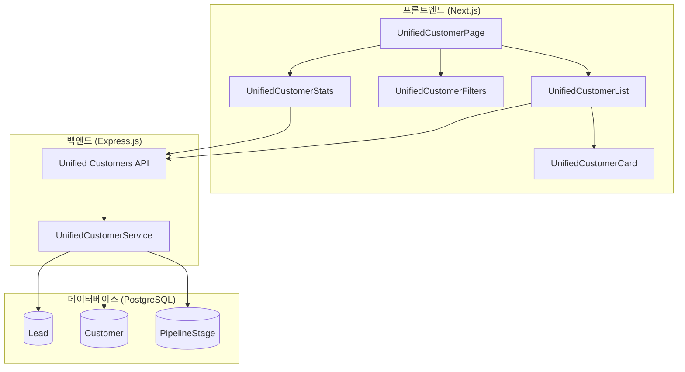
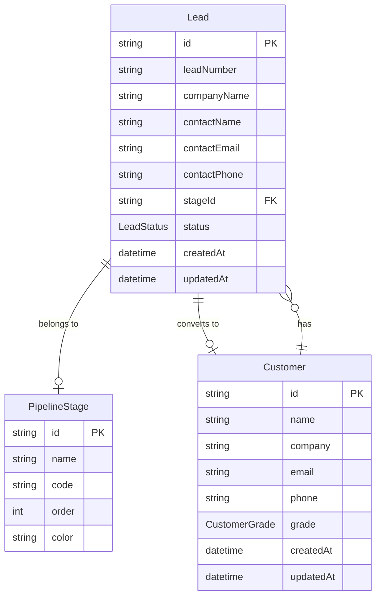
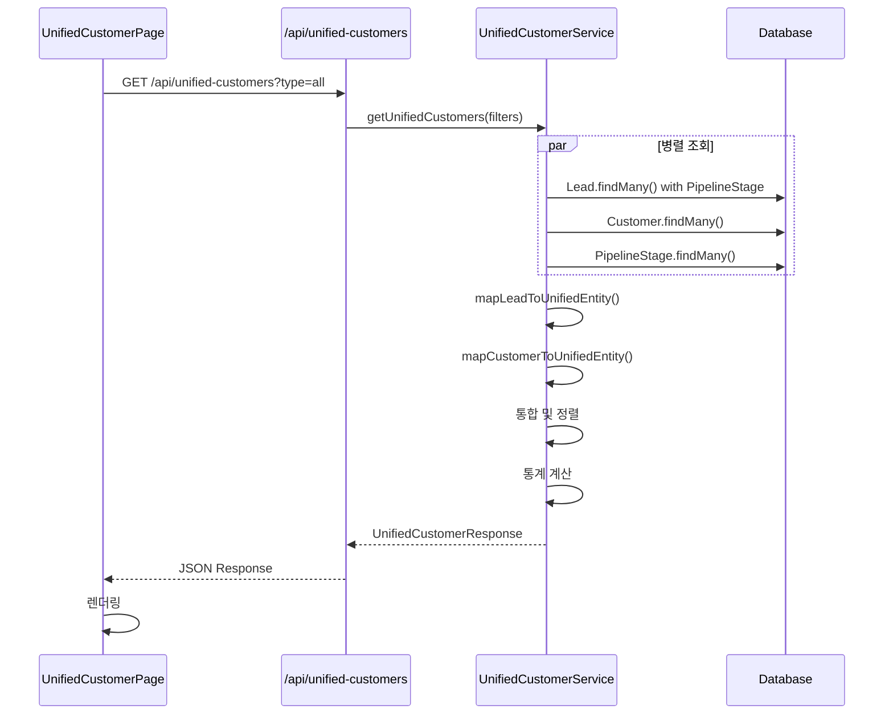

# 설계 문서: Unified Customer Management

## 개요

본 설계 문서는 고객사 관리 페이지에서 리드(Lead)와 고객(Customer)을 통합하여 표시하는 기능의 기술적 설계를 정의합니다. 기존의 분리된 리드 관리(/leads)와 고객사 관리(/customers) 페이지를 통합하여, 영업 담당자가 리드 단계부터 고객 전환까지 전체 고객 관계를 하나의 뷰에서 관리할 수 있도록 합니다.

## 아키텍처



## 컴포넌트 및 인터페이스

### 1. 통합 엔티티 타입 정의

```typescript
// types/unified-customer.ts

// 통합 엔티티 유형
type EntityType = 'LEAD' | 'CUSTOMER';

// 통합 엔티티 인터페이스
interface UnifiedEntity {
  id: string;
  entityType: EntityType;
  
  // 공통 필드
  companyName: string;
  contactName: string;
  contactEmail: string | null;
  contactPhone: string | null;
  
  // 단계 정보
  displayStage: string;      // 표시용 단계명
  stageColor: string;        // 단계 색상
  stageOrder: number;        // 정렬용 순서
  
  // 리드 전용 필드 (entityType === 'LEAD'인 경우)
  leadNumber?: string;
  leadStatus?: LeadStatus;
  stageId?: string;
  expectedAmount?: number;
  source?: LeadSource;
  
  // 고객 전용 필드 (entityType === 'CUSTOMER'인 경우)
  grade?: CustomerGrade;
  quotationCount?: number;
  totalAmount?: number;
  
  // 메타데이터
  createdAt: string;
  updatedAt: string;
}

// 필터 옵션
interface UnifiedCustomerFilters {
  type?: 'all' | 'lead' | 'customer';
  stageId?: string;
  search?: string;
  page?: number;
  limit?: number;
}

// API 응답
interface UnifiedCustomerResponse {
  data: UnifiedEntity[];
  pagination: {
    total: number;
    page: number;
    limit: number;
    totalPages: number;
  };
  stats: {
    totalCount: number;
    leadCount: number;
    customerCount: number;
    stageDistribution: Record<string, number>;
  };
}
```

### 2. UnifiedCustomerPage 컴포넌트

```typescript
// app/(dashboard)/customers/page.tsx (수정)

interface UnifiedCustomerPageState {
  entities: UnifiedEntity[];
  loading: boolean;
  filters: UnifiedCustomerFilters;
  stats: UnifiedCustomerStats;
  stages: PipelineStage[];
}

interface UnifiedCustomerStats {
  totalCount: number;
  leadCount: number;
  customerCount: number;
  stageDistribution: Record<string, number>;
}
```

### 3. UnifiedCustomerFilters 컴포넌트

```typescript
// components/customer/UnifiedCustomerFilters.tsx

interface UnifiedCustomerFiltersProps {
  filters: UnifiedCustomerFilters;
  stages: PipelineStage[];
  onFilterChange: (filters: UnifiedCustomerFilters) => void;
}

// 단계 필터 옵션 (동적 생성)
interface StageFilterOption {
  value: string;
  label: string;
  color?: string;
  count?: number;
}
```

### 4. UnifiedCustomerCard 컴포넌트

```typescript
// components/customer/UnifiedCustomerCard.tsx

interface UnifiedCustomerCardProps {
  entity: UnifiedEntity;
  onClick: (entity: UnifiedEntity) => void;
}

// 엔티티 유형별 배지 설정
const entityTypeBadgeConfig: Record<EntityType, { label: string; className: string }> = {
  LEAD: { label: '리드', className: 'bg-blue-100 text-blue-700' },
  CUSTOMER: { label: '고객', className: 'bg-green-100 text-green-700' },
};
```

### 5. UnifiedCustomerStats 컴포넌트

```typescript
// components/customer/UnifiedCustomerStats.tsx

interface UnifiedCustomerStatsProps {
  stats: UnifiedCustomerStats;
  loading: boolean;
}
```

### 6. Backend Service

```typescript
// backend/src/services/unifiedCustomerService.ts

interface UnifiedCustomerService {
  getUnifiedCustomers(filters: UnifiedCustomerFilters, userId: string): Promise<UnifiedCustomerResponse>;
  getStageDistribution(userId: string): Promise<Record<string, number>>;
}

// 리드를 UnifiedEntity로 변환
function mapLeadToUnifiedEntity(lead: Lead & { stage: PipelineStage }): UnifiedEntity {
  return {
    id: lead.id,
    entityType: 'LEAD',
    companyName: lead.companyName,
    contactName: lead.contactName,
    contactEmail: lead.contactEmail,
    contactPhone: lead.contactPhone,
    displayStage: lead.stage.name,
    stageColor: lead.stage.color || '#6B7280',
    stageOrder: lead.stage.order,
    leadNumber: lead.leadNumber,
    leadStatus: lead.status,
    stageId: lead.stageId,
    expectedAmount: lead.expectedAmount?.toNumber(),
    source: lead.source,
    createdAt: lead.createdAt.toISOString(),
    updatedAt: lead.updatedAt.toISOString(),
  };
}

// 고객을 UnifiedEntity로 변환
function mapCustomerToUnifiedEntity(customer: Customer): UnifiedEntity {
  const gradeStageMap: Record<CustomerGrade, { name: string; color: string; order: number }> = {
    LEAD: { name: '리드', color: '#6B7280', order: 0 },
    PROSPECT: { name: '잠재고객', color: '#3B82F6', order: 1 },
    CUSTOMER: { name: '계약완료', color: '#10B981', order: 100 },
    VIP: { name: 'VIP', color: '#8B5CF6', order: 101 },
    INACTIVE: { name: '비활성', color: '#EF4444', order: 102 },
  };
  
  const stageInfo = gradeStageMap[customer.grade];
  
  return {
    id: customer.id,
    entityType: 'CUSTOMER',
    companyName: customer.company || customer.name,
    contactName: customer.name,
    contactEmail: customer.email,
    contactPhone: customer.phone,
    displayStage: stageInfo.name,
    stageColor: stageInfo.color,
    stageOrder: stageInfo.order,
    grade: customer.grade,
    createdAt: customer.createdAt.toISOString(),
    updatedAt: customer.updatedAt.toISOString(),
  };
}
```

### 7. API 엔드포인트

```typescript
// backend/src/routes/unifiedCustomers.ts

// GET /api/unified-customers
interface GetUnifiedCustomersQuery {
  type?: 'all' | 'lead' | 'customer';
  stageId?: string;
  search?: string;
  page?: number;
  limit?: number;
  sortBy?: 'updatedAt' | 'createdAt' | 'companyName';
  sortOrder?: 'asc' | 'desc';
}

// Response
interface GetUnifiedCustomersResponse {
  success: boolean;
  data: {
    entities: UnifiedEntity[];
    pagination: {
      total: number;
      page: number;
      limit: number;
      totalPages: number;
    };
    stats: {
      totalCount: number;
      leadCount: number;
      customerCount: number;
      stageDistribution: Record<string, number>;
    };
  };
}
```

## 데이터 모델

### 기존 모델 활용

본 기능은 기존 Lead, Customer, PipelineStage 모델을 그대로 활용하며, 새로운 테이블 생성 없이 서비스 레이어에서 데이터를 통합합니다.



### 데이터 통합 흐름




## 정확성 속성 (Correctness Properties)

*정확성 속성은 시스템의 모든 유효한 실행에서 참이어야 하는 특성 또는 동작입니다. 이는 사람이 읽을 수 있는 명세와 기계가 검증할 수 있는 정확성 보장 사이의 다리 역할을 합니다.*

### Property 1: 통합 데이터 반환 일관성

*For any* API 호출에서 type='all' 필터가 적용된 경우, 반환된 데이터에는 Lead 테이블과 Customer 테이블의 데이터가 모두 포함되어야 합니다. 즉, 데이터베이스에 리드와 고객이 모두 존재하면 반환된 배열에 entityType이 'LEAD'인 항목과 'CUSTOMER'인 항목이 모두 존재해야 합니다.

**Validates: Requirements 1.1, 6.2**

### Property 2: 엔티티 필수 필드 포함

*For any* 반환된 UnifiedEntity에 대해:
- entityType 필드는 'LEAD' 또는 'CUSTOMER' 값을 가져야 합니다
- displayStage, stageColor 필드는 null이 아니어야 합니다
- entityType이 'LEAD'인 경우 companyName, contactName, stageId 필드가 존재해야 합니다
- entityType이 'CUSTOMER'인 경우 companyName, contactName, grade 필드가 존재해야 합니다

**Validates: Requirements 1.2, 1.3, 1.4, 6.6**

### Property 3: 정렬 순서 일관성

*For any* 반환된 UnifiedEntity 배열에서, 기본 정렬 시 배열의 각 항목 i에 대해 entities[i].updatedAt >= entities[i+1].updatedAt 조건이 성립해야 합니다 (최신 업데이트 순 내림차순).

**Validates: Requirements 1.5**

### Property 4: 파이프라인 단계 표시 정확성

*For any* 반환된 UnifiedEntity에 대해:
- entityType이 'LEAD'인 경우, displayStage는 해당 리드의 PipelineStage.name과 일치하고, stageColor는 PipelineStage.color와 일치해야 합니다
- entityType이 'LEAD'이고 leadStatus가 'CONVERTED'인 경우, displayStage는 "계약전환"이어야 합니다
- entityType이 'CUSTOMER'인 경우, displayStage는 grade에 따른 매핑 값(CUSTOMER→"계약완료", VIP→"VIP" 등)과 일치해야 합니다

**Validates: Requirements 2.1, 2.2, 2.3, 2.4**

### Property 5: 단계 필터링 정확성

*For any* API 호출에서 stageId 파라미터가 전달된 경우, 반환된 모든 항목 중 entityType이 'LEAD'인 항목의 stageId는 요청된 stageId와 일치해야 합니다.

**Validates: Requirements 3.2, 6.3**

### Property 6: 유형 필터링 정확성

*For any* API 호출에서:
- type='lead' 파라미터가 전달된 경우, 반환된 모든 항목의 entityType은 'LEAD'여야 합니다
- type='customer' 파라미터가 전달된 경우, 반환된 모든 항목의 entityType은 'CUSTOMER'여야 합니다

**Validates: Requirements 3.3, 4.2, 4.3, 6.4**

### Property 7: 복합 필터 교집합

*For any* API 호출에서 여러 필터(type, stageId, search)가 동시에 적용된 경우, 반환된 모든 항목은 적용된 모든 필터 조건을 만족해야 합니다.

**Validates: Requirements 4.4, 5.3**

### Property 8: 검색 필터 정확성

*For any* API 호출에서 search 파라미터가 전달된 경우, 반환된 모든 항목은 companyName, contactName, contactEmail, contactPhone 필드 중 하나 이상에 검색어를 포함해야 합니다 (대소문자 무시).

**Validates: Requirements 5.1, 5.2, 6.5**

### Property 9: 통계 정확성

*For any* API 응답에서:
- stats.totalCount는 반환된 entities 배열의 길이와 일치해야 합니다 (페이지네이션 적용 전 전체 수)
- stats.leadCount는 entityType이 'LEAD'인 항목의 수와 일치해야 합니다
- stats.customerCount는 entityType이 'CUSTOMER'인 항목의 수와 일치해야 합니다
- stats.leadCount + stats.customerCount = stats.totalCount 조건이 성립해야 합니다

**Validates: Requirements 7.1, 7.2, 7.3, 7.4**

## 오류 처리

### 1. API 오류

| 오류 상황 | HTTP 상태 | 처리 방법 |
|----------|----------|----------|
| 인증 실패 | 401 | 로그인 페이지로 리다이렉트 |
| 권한 없음 | 403 | 권한 없음 메시지 표시 |
| 잘못된 필터 파라미터 | 400 | 기본값으로 폴백, 경고 메시지 표시 |
| 서버 오류 | 500 | 재시도 버튼과 함께 오류 메시지 표시 |

### 2. 데이터 로딩 오류

| 오류 상황 | 처리 방법 |
|----------|----------|
| 네트워크 오류 | 재시도 버튼 표시, 오프라인 상태 안내 |
| 빈 결과 | "검색 결과가 없습니다" 메시지와 필터 초기화 버튼 표시 |
| PipelineStage 로딩 실패 | 기본 단계 옵션으로 폴백 |

### 3. 네비게이션 오류

| 오류 상황 | 처리 방법 |
|----------|----------|
| 존재하지 않는 리드/고객 ID | 404 페이지 표시 또는 목록으로 리다이렉트 |
| 잘못된 URL 파라미터 | 기본 필터로 폴백 |

## 테스트 전략

### 1. 단위 테스트

단위 테스트는 특정 예제, 엣지 케이스, 오류 조건을 검증합니다.

#### 프론트엔드 컴포넌트 테스트
- UnifiedCustomerCard 렌더링 테스트 (리드/고객 유형별)
- UnifiedCustomerFilters 필터 변경 이벤트 테스트
- UnifiedCustomerStats 통계 표시 테스트
- 빈 상태 및 로딩 상태 렌더링 테스트

#### 백엔드 서비스 테스트
- mapLeadToUnifiedEntity 변환 정확성
- mapCustomerToUnifiedEntity 변환 정확성
- 필터 조합별 쿼리 생성 테스트
- 통계 계산 정확성 테스트

### 2. 속성 기반 테스트 (Property-Based Testing)

속성 기반 테스트는 모든 유효한 입력에 대해 보편적 속성을 검증합니다. 각 테스트는 최소 100회 반복 실행됩니다.

#### 테스트 라이브러리
- Backend: fast-check (TypeScript/JavaScript)
- Frontend: @fast-check/vitest

#### 속성 테스트 목록

```typescript
// Feature: unified-customer-management, Property 1: 통합 데이터 반환 일관성
describe('Unified Data Return Consistency', () => {
  it.prop([fc.array(leadArbitrary), fc.array(customerArbitrary)])(
    'should return both leads and customers when type=all',
    async (leads, customers) => {
      // 테스트 구현
    }
  );
});

// Feature: unified-customer-management, Property 2: 엔티티 필수 필드 포함
describe('Entity Required Fields', () => {
  it.prop([unifiedEntityArbitrary])(
    'should include all required fields based on entityType',
    async (entity) => {
      // 테스트 구현
    }
  );
});

// Feature: unified-customer-management, Property 6: 유형 필터링 정확성
describe('Type Filtering Accuracy', () => {
  it.prop([fc.constantFrom('lead', 'customer')])(
    'should return only entities matching the type filter',
    async (typeFilter) => {
      // 테스트 구현
    }
  );
});

// Feature: unified-customer-management, Property 8: 검색 필터 정확성
describe('Search Filtering Accuracy', () => {
  it.prop([fc.string({ minLength: 1, maxLength: 50 })])(
    'should return only entities containing the search term',
    async (searchTerm) => {
      // 테스트 구현
    }
  );
});

// Feature: unified-customer-management, Property 9: 통계 정확성
describe('Statistics Accuracy', () => {
  it.prop([fc.array(unifiedEntityArbitrary)])(
    'should calculate correct statistics from entities',
    async (entities) => {
      // 테스트 구현
    }
  );
});
```

### 3. 통합 테스트

- API 엔드포인트 전체 플로우 테스트
- 필터 조합별 응답 검증
- 페이지네이션 동작 검증
- 프론트엔드-백엔드 통합 테스트

### 4. E2E 테스트

- 고객사 관리 페이지 로딩 및 데이터 표시
- 필터 적용 및 URL 파라미터 동기화
- 검색 기능 동작
- 항목 클릭 시 상세 페이지 이동
- 뒤로가기 시 필터 상태 유지
