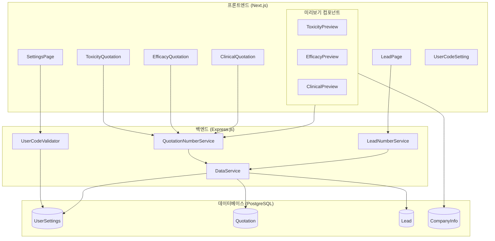
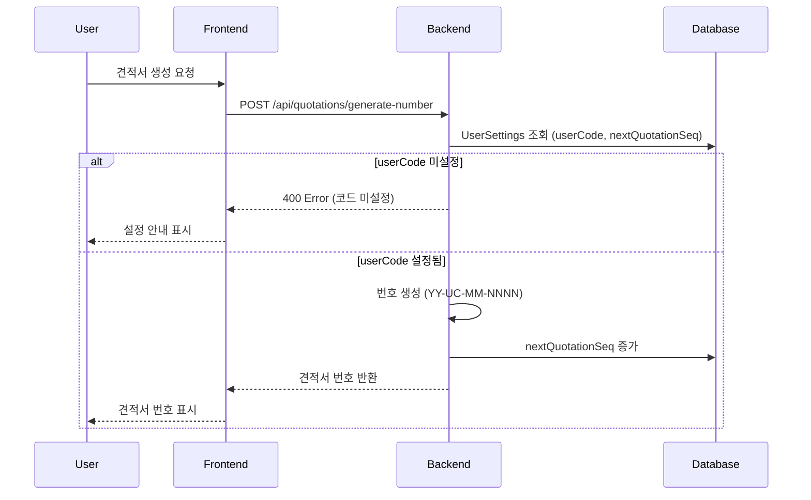
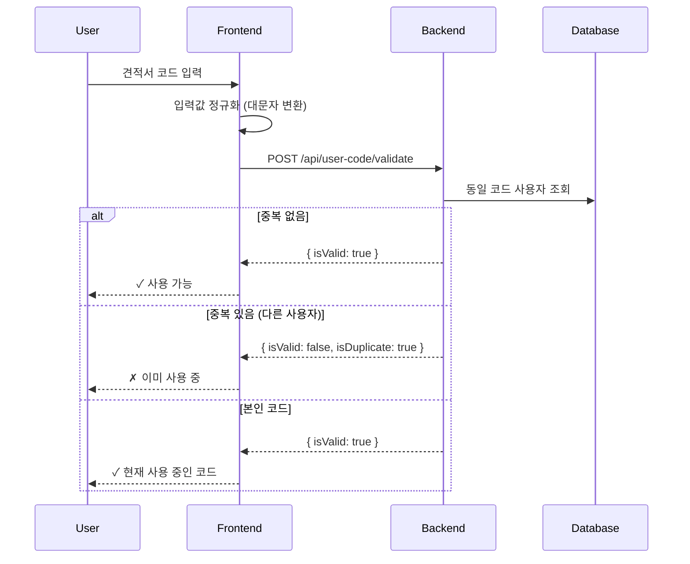

# 설계 문서: Unified Quotation Code System

## 개요

본 설계 문서는 CHEMON 견적관리시스템의 통합 견적서 코드 시스템에 대한 기술적 설계를 정의합니다. 독성시험, 효력시험, 임상병리시험 등 모든 시험 유형에서 견적서 번호 체계를 통합하고, 리드 번호도 사용자 설정 견적서 코드를 따르도록 개선합니다.

## 아키텍처



## 컴포넌트 및 인터페이스

### 1. QuotationNumberService (확장)

모든 시험 유형의 견적서 번호를 통합 생성하는 서비스입니다.

```typescript
// backend/src/services/quotationNumberService.ts

interface QuotationNumberService {
  generateQuotationNumber(userId: string, quotationType: QuotationType): Promise<string>;
  validateUserCode(userId: string): Promise<boolean>;
  getNextSequence(userId: string): Promise<number>;
}

interface QuotationNumberConfig {
  format: 'YY-UC-MM-NNNN';  // 연도-사용자코드-월-일련번호
  yearDigits: 2;
  sequenceDigits: 4;
}

// 견적서 번호 생성 예시
// User Code: DL, 2025년 1월, 일련번호 1 → "25-DL-01-0001"
```

### 2. LeadNumberService (신규)

리드 번호를 사용자 코드 기반으로 생성하는 서비스입니다.

```typescript
// backend/src/services/leadNumberService.ts

interface LeadNumberService {
  generateLeadNumber(userId: string): Promise<string>;
  getNextLeadSequence(userId: string): Promise<number>;
}

interface LeadNumberConfig {
  format: 'UC-YYYY-NNNN';  // 사용자코드-연도-일련번호
  yearDigits: 4;
  sequenceDigits: 4;
}

// 리드 번호 생성 예시
// User Code: DL, 2025년, 일련번호 1 → "DL-2025-0001"
```

### 3. UserCodeValidator (신규)

사용자 코드 중복 검사를 수행하는 서비스입니다.

```typescript
// backend/src/services/userCodeValidator.ts

interface UserCodeValidator {
  validateUniqueness(userCode: string, currentUserId: string): Promise<ValidationResult>;
  normalizeCode(userCode: string): string;
  isValidFormat(userCode: string): boolean;
}

interface ValidationResult {
  isValid: boolean;
  error?: string;
  normalizedCode?: string;
}

// 유효성 검사 규칙
// 1. 2글자 영문만 허용
// 2. 대소문자 구분 없이 중복 검사
// 3. 저장 시 대문자로 변환
```

### 4. 프론트엔드 컴포넌트

#### 4.1 UnifiedQuotationPreview (신규)

모든 시험 유형에서 공통으로 사용하는 견적서 미리보기 레이아웃입니다.

```typescript
// components/quotation/UnifiedQuotationPreview.tsx

interface UnifiedQuotationPreviewProps {
  quotationType: 'TOXICITY' | 'EFFICACY' | 'CLINICAL';
  quotationNumber: string;
  companyInfo: CompanyInfo;
  customerInfo: CustomerInfo;
  items: QuotationItem[];
  amounts: QuotationAmounts;
  notes?: string;
  validUntil?: Date;
}

interface CompanyInfo {
  name: string;
  nameEn?: string;
  address: string;
  addressEn?: string;
  tel: string;
  fax?: string;
  email?: string;
  logo?: string;
  businessNumber?: string;
  ceoName?: string;
}
```

#### 4.2 UserCodeSetting (확장)

견적서 코드 설정 컴포넌트에 중복 검사 기능을 추가합니다.

```typescript
// components/settings/UserCodeSetting.tsx

interface UserCodeSettingProps {
  currentCode?: string;
  onSave: (code: string) => void;
  isLoading: boolean;
}

interface UserCodeSettingState {
  inputCode: string;
  isChecking: boolean;
  isDuplicate: boolean;
  errorMessage?: string;
}
```

#### 4.3 QuotationCodeGuard (신규)

견적서 코드 미설정 시 안내를 표시하는 가드 컴포넌트입니다.

```typescript
// components/quotation/QuotationCodeGuard.tsx

interface QuotationCodeGuardProps {
  userCode?: string;
  children: React.ReactNode;
  quotationType: 'TOXICITY' | 'EFFICACY' | 'CLINICAL';
}

// 사용 예시
// <QuotationCodeGuard userCode={userCode} quotationType="EFFICACY">
//   <EfficacyQuotationWizard />
// </QuotationCodeGuard>
```

### 5. API 엔드포인트

#### 5.1 User Code API (신규)

```typescript
// POST /api/user-code/validate
// 견적서 코드 중복 검사
interface ValidateUserCodeRequest {
  userCode: string;
}

interface ValidateUserCodeResponse {
  isValid: boolean;
  isDuplicate: boolean;
  normalizedCode: string;
  error?: string;
}

// PUT /api/user-settings/user-code
// 견적서 코드 저장
interface UpdateUserCodeRequest {
  userCode: string;
}

interface UpdateUserCodeResponse {
  success: boolean;
  userCode: string;
  error?: string;
}
```

#### 5.2 Quotation Number API (확장)

```typescript
// POST /api/quotations/generate-number
// 견적서 번호 생성 (모든 시험 유형 통합)
interface GenerateQuotationNumberRequest {
  quotationType: 'TOXICITY' | 'EFFICACY' | 'CLINICAL';
}

interface GenerateQuotationNumberResponse {
  quotationNumber: string;
  sequence: number;
}
```

#### 5.3 Lead Number API (확장)

```typescript
// POST /api/leads/generate-number
// 리드 번호 생성 (사용자 코드 기반)
interface GenerateLeadNumberResponse {
  leadNumber: string;
  sequence: number;
}
```

## 데이터 모델

### 1. UserSettings 모델 확장

```prisma
model UserSettings {
  id                      String   @id @default(uuid())
  userId                  String   @unique
  
  // 견적 설정
  userCode                String?  @unique  // 고유 제약 조건 추가
  defaultValidityDays     Int      @default(30)
  defaultDiscountRate     Int      @default(0)
  
  // 일련번호 관리 (시험 유형 통합)
  nextQuotationSeq        Int      @default(1)  // 통합 견적서 일련번호
  nextLeadSeq             Int      @default(1)  // 리드 일련번호
  
  // ... 기타 필드
  
  createdAt               DateTime @default(now())
  updatedAt               DateTime @updatedAt
  
  @@index([userCode])
}
```

### 2. 번호 생성 흐름



### 3. 코드 중복 검사 흐름




## 정확성 속성 (Correctness Properties)

*정확성 속성은 시스템의 모든 유효한 실행에서 참이어야 하는 특성 또는 동작입니다. 이는 사람이 읽을 수 있는 명세와 기계가 검증할 수 있는 정확성 보장 사이의 다리 역할을 합니다.*

### Property 1: 견적서 번호 형식 일관성

*For any* 시험 유형(독성, 효력, 임상병리)과 사용자 코드에 대해, 생성된 견적서 번호는 항상 "YY-UC-MM-NNNN" 형식을 따라야 합니다. 여기서 YY는 2자리 연도, UC는 사용자 코드, MM은 2자리 월, NNNN은 4자리 일련번호입니다.

**Validates: Requirements 1.1, 1.2, 1.3**

### Property 2: 견적서 일련번호 순차 증가

*For any* 사용자가 여러 견적서를 생성할 때, 시험 유형에 관계없이 일련번호는 항상 이전 값보다 정확히 1 증가해야 합니다. 견적서 생성 후 사용자의 next_quotation_seq 값은 생성 전 값 + 1과 같아야 합니다.

**Validates: Requirements 1.4, 1.5**

### Property 3: 미리보기 정보 포함

*For any* 시험 유형의 견적서 미리보기에서, 렌더링된 출력에는 견적번호와 회사 정보(회사명, 주소, 연락처)가 포함되어야 합니다. 입력된 회사 정보의 모든 필드가 출력에 존재해야 합니다.

**Validates: Requirements 2.1, 2.2, 2.4, 2.5**

### Property 4: 리드 번호 형식 및 시퀀스

*For any* 사용자 코드에 대해, 생성된 리드 번호는 "UC-YYYY-NNNN" 형식을 따라야 합니다. 리드 생성 후 사용자의 next_lead_seq 값은 생성 전 값 + 1과 같아야 합니다.

**Validates: Requirements 3.1, 3.3**

### Property 5: 코드 미설정 시 오류 처리

*For any* User_Code가 설정되지 않은 사용자가 견적서 또는 리드 생성을 시도하면, 시스템은 적절한 오류 메시지와 함께 생성을 거부해야 합니다.

**Validates: Requirements 3.4, 5.1, 5.2**

### Property 6: 코드 중복 검사 정확성

*For any* 두 사용자 A와 B에 대해, A가 B의 User_Code와 동일한 코드(대소문자 무시)를 설정하려고 하면 중복 오류가 발생해야 합니다. 단, 사용자가 자신의 기존 코드와 동일한 값을 입력하면 중복 오류가 발생하지 않아야 합니다.

**Validates: Requirements 4.1, 4.2, 4.3, 4.5**

### Property 7: 코드 정규화

*For any* 대소문자 조합의 User_Code 입력에 대해, 저장된 값은 항상 대문자로 변환되어야 합니다. 예: "dl" → "DL", "Dl" → "DL"

**Validates: Requirements 4.6**

### Property 8: 코드 변경 영향 범위

*For any* User_Code 변경에 대해, 변경 후 생성되는 견적서와 리드는 새 코드를 사용해야 하고, 변경 전에 생성된 견적서와 리드의 번호는 변경되지 않아야 합니다.

**Validates: Requirements 5.4, 5.5**

### Property 9: 기존 리드 번호 불변성

*For any* 저장된 리드에 대해, 조회 시 반환되는 Lead_Number는 생성 시점에 저장된 값과 동일해야 합니다.

**Validates: Requirements 3.5**

## 오류 처리

### 1. 견적서 코드 관련 오류

| 오류 상황 | 처리 방법 |
|----------|----------|
| User_Code 미설정 상태에서 견적서 생성 | "견적서 코드가 설정되지 않았습니다" 메시지와 설정 페이지 링크 표시 |
| User_Code 미설정 상태에서 리드 생성 | "견적서 코드가 설정되지 않았습니다" 메시지와 설정 페이지 링크 표시 |
| User_Code 중복 | "이미 사용 중인 견적서 코드입니다" 메시지 표시, 저장 거부 |
| User_Code 형식 오류 (2글자 영문 아님) | "견적서 코드는 2글자 영문이어야 합니다" 메시지 표시 |

### 2. 번호 생성 관련 오류

| 오류 상황 | 처리 방법 |
|----------|----------|
| 일련번호 조회 실패 | 트랜잭션 롤백, 재시도 안내 |
| 일련번호 업데이트 실패 | 트랜잭션 롤백, 번호 생성 취소 |
| 동시 요청으로 인한 충돌 | 낙관적 잠금으로 재시도 |

### 3. 미리보기 관련 오류

| 오류 상황 | 처리 방법 |
|----------|----------|
| 회사 정보 로드 실패 | 기본값 사용, 오류 로그 기록 |
| PDF 생성 실패 | 오류 메시지 표시, 재시도 버튼 제공 |

## 테스트 전략

### 1. 단위 테스트

단위 테스트는 특정 예제, 엣지 케이스, 오류 조건을 검증합니다.

#### 백엔드 서비스 테스트
- QuotationNumberService.generateQuotationNumber 각 시험 유형별 테스트
- LeadNumberService.generateLeadNumber 테스트
- UserCodeValidator.validateUniqueness 중복/비중복 케이스 테스트
- UserCodeValidator.normalizeCode 대소문자 변환 테스트

#### 프론트엔드 컴포넌트 테스트
- UnifiedQuotationPreview 렌더링 테스트 (각 시험 유형별)
- UserCodeSetting 중복 검사 UI 테스트
- QuotationCodeGuard 가드 동작 테스트

### 2. 속성 기반 테스트 (Property-Based Testing)

속성 기반 테스트는 모든 유효한 입력에 대해 보편적 속성을 검증합니다. 각 테스트는 최소 100회 반복 실행됩니다.

#### 테스트 라이브러리
- Backend: fast-check (TypeScript/JavaScript)
- Frontend: @fast-check/vitest

#### 속성 테스트 목록

```typescript
// Feature: unified-quotation-code, Property 1: 견적서 번호 형식 일관성
describe('Quotation Number Format Consistency', () => {
  it.prop([
    fc.constantFrom('TOXICITY', 'EFFICACY', 'CLINICAL'),
    fc.string({ minLength: 2, maxLength: 2 }).filter(s => /^[A-Z]{2}$/.test(s)),
    fc.integer({ min: 2020, max: 2099 }),
    fc.integer({ min: 1, max: 12 }),
    fc.integer({ min: 1, max: 9999 })
  ])(
    'should generate quotation number in YY-UC-MM-NNNN format for all test types',
    async (quotationType, userCode, year, month, seq) => {
      // 테스트 구현
    }
  );
});

// Feature: unified-quotation-code, Property 2: 견적서 일련번호 순차 증가
describe('Quotation Sequence Increment', () => {
  it.prop([
    fc.array(fc.constantFrom('TOXICITY', 'EFFICACY', 'CLINICAL'), { minLength: 1, maxLength: 10 })
  ])(
    'should increment sequence by 1 for each quotation regardless of type',
    async (quotationTypes) => {
      // 테스트 구현
    }
  );
});

// Feature: unified-quotation-code, Property 4: 리드 번호 형식 및 시퀀스
describe('Lead Number Format and Sequence', () => {
  it.prop([
    fc.string({ minLength: 2, maxLength: 2 }).filter(s => /^[A-Z]{2}$/.test(s)),
    fc.integer({ min: 2020, max: 2099 }),
    fc.integer({ min: 1, max: 9999 })
  ])(
    'should generate lead number in UC-YYYY-NNNN format',
    async (userCode, year, seq) => {
      // 테스트 구현
    }
  );
});

// Feature: unified-quotation-code, Property 6: 코드 중복 검사 정확성
describe('User Code Duplicate Validation', () => {
  it.prop([
    fc.string({ minLength: 2, maxLength: 2 }).filter(s => /^[A-Za-z]{2}$/.test(s)),
    fc.string({ minLength: 2, maxLength: 2 }).filter(s => /^[A-Za-z]{2}$/.test(s)),
    fc.uuid(),
    fc.uuid()
  ])(
    'should detect duplicates case-insensitively except for own code',
    async (codeA, codeB, userIdA, userIdB) => {
      // 테스트 구현
    }
  );
});

// Feature: unified-quotation-code, Property 7: 코드 정규화
describe('User Code Normalization', () => {
  it.prop([
    fc.string({ minLength: 2, maxLength: 2 }).filter(s => /^[A-Za-z]{2}$/.test(s))
  ])(
    'should always normalize code to uppercase',
    async (inputCode) => {
      // 테스트 구현
    }
  );
});

// Feature: unified-quotation-code, Property 8: 코드 변경 영향 범위
describe('User Code Change Impact', () => {
  it.prop([
    fc.string({ minLength: 2, maxLength: 2 }).filter(s => /^[A-Z]{2}$/.test(s)),
    fc.string({ minLength: 2, maxLength: 2 }).filter(s => /^[A-Z]{2}$/.test(s)),
    fc.array(fc.uuid(), { minLength: 1, maxLength: 5 })
  ])(
    'should only affect new quotations after code change',
    async (oldCode, newCode, existingQuotationIds) => {
      // 테스트 구현
    }
  );
});
```

### 3. 통합 테스트

- 견적서 생성 → 번호 생성 → 시퀀스 업데이트 전체 플로우
- 리드 생성 → 번호 생성 → 시퀀스 업데이트 전체 플로우
- 코드 설정 → 중복 검사 → 저장 전체 플로우
- 코드 변경 → 새 견적서 생성 → 기존 견적서 확인 플로우

### 4. E2E 테스트

- 설정 페이지에서 견적서 코드 설정 및 중복 검사 UI 플로우
- 효력시험 견적서 작성 → 미리보기 → PDF 내보내기 플로우
- 코드 미설정 상태에서 견적서 작성 시도 → 안내 메시지 확인 플로우

